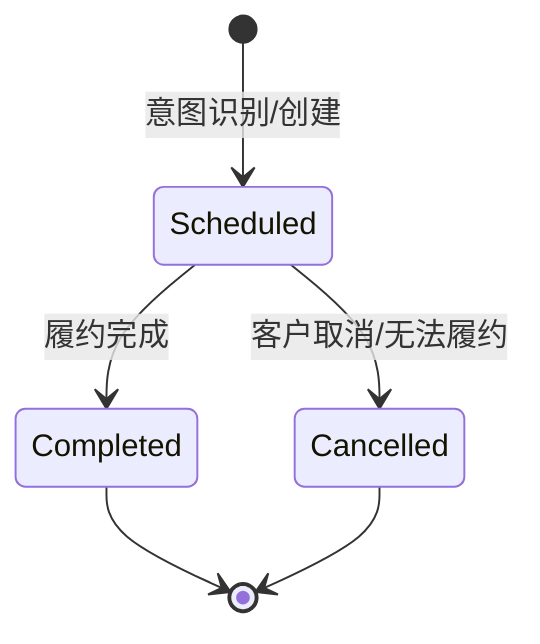

# 预约管理系统 (Appointment Management System) 设计文档

**版本**: 1.0.0
**状态**: 本地开发 (In Development)
**维护者**: Backend Team

---

## 1. 业务概述

预约管理系统 (Appointment Management System) 是智能语音助手在完成通话后，实现业务闭环的关键模块。它负责将非结构化的语音对话转化为结构化的业务预约记录，并提供后续的管理和跟进能力。

### 1.1 核心能力
*   **智能提取**: 利用 LLM 从对话中自动提取关键预约信息（时间、地点、联系人、具体需求等）。
*   **通话关联**: 每个预约严格关联一次通话记录 (Call)，确保业务来源可追溯。
*   **状态追踪**: 管理预约从“已调度 (Scheduled)”到“已完成 (Completed)”或“已取消 (Cancelled)”的全生命周期。
*   **模拟测试**: 提供模拟数据生成接口，方便开发和测试环节无需实际拨打电话即可验证业务流程。

---

## 2. 系统架构

本模块同样采用分层架构，与通话管理系统深度集成。

```mermaid
graph TD
    Client[前端/客户端] --> API[API Layer (FastAPI)]
    API --> Service[Service Layer (Business Logic)]
    Service -.-> |关联| CallService[Call Service]
    Service --> |CRUD操作| DB[(PostgreSQL Database)]
    Twilio[Twilio/Voice Service] --> |提取意图| Service
```

### 2.1 模块职责
*   **API Layer (`endpoints/appointments.py`)**: 提供预约的增删改查 RESTful 接口。
*   **Simulation Layer (`endpoints/appointment_simulation.py`)**: 提供模拟数据生成和清理的辅助接口。
*   **Service Layer (`services/appointment_service.py`)**: 核心业务逻辑。处理从对话文本提取预约信息（未来规划），以及预约状态的流转。
*   **Model Layer (`models/appointment.py`)**: 数据库实体定义。与 `Call` 模型是一对一 (1:1) 关系。

---

## 3. 数据模型设计

### 3.1 实体关系图 (ERD)

```mermaid
erDiagram
    CALL ||--|| APPOINTMENT : "generates (1:1)"
    CALL {
        UUID id PK
        String counterpart
        DateTime started_at
        ...
    }
    APPOINTMENT {
        UUID id PK,FK "与 Call ID 相同"
        String caller_name "客户姓名"
        String company "公司名称"
        DateTime time "预约时间"
        String category "业务类别"
        String amount "数量/规模"
        String address "地址"
        String status "状态: scheduled, completed, cancelled"
        Text summary "AI生成的预约摘要"
        Text extra_request "额外需求"
        JSONB raw_messages "对话原始记录"
    }
```

### 3.2 关键字段说明

| 字段名 | 类型 | 说明 | 业务规则 |
| :--- | :--- | :--- | :--- |
| `id` | UUID | 主键/外键 | **必须**与关联的 `calls.id` 一致。表示该预约是由特定通话产生的。 |
| `time` | DateTime | 预约时间 | 客户期望的服务/上门时间。 |
| `status` | String | 状态 | 默认为 `scheduled`。 |
| `category` | String | 业务类别 | 如：粗大垃圾回收、家电回收等。 |
| `amount` | String | 数量/规模 | 非结构化描述，如 "3个"、"一卡车"。 |
| `extra_request` | Text | 额外需求 | 客户提出的特殊要求，如"需要发票"、"到达前电话"。 |

---

## 4. 业务逻辑与状态机

### 4.1 预约状态流转



### 4.2 核心业务流程
1.  **意图识别 (Voice Service)**: 在通话过程中或结束后，Voice Service 判断用户具有明确的预约意图。
2.  **创建预约**:
    *   调用 `AppointmentService`。
    *   传入关联的 `call_id`。
    *   传入从对话中提取的结构化参数 (Json)。
    *   **约束**: 如果该 `call_id` 已存在预约，则覆盖或报错 (当前逻辑为报错)。
3.  **人工确认/排程**: 后台管理员查看预约列表，确认信息有效，安排具体执行人员。
4.  **履约反馈**: 业务完成后，更新状态为 `completed`。

---

## 5. API 接口规范

设计遵循 RESTful 规范，基础路径为 `/api/v1/appointments`。

### 5.1 获取预约列表
`GET /api/v1/appointments`

**功能**: 分页获取预约记录。

**请求参数**:
*   `page`: 页码
*   `page_size`: 每页数量
*   `sort_by`: 排序字段 (默认 `time`)
*   `order`: 排序方向 (`asc`/`desc`)
*   `search`: 搜索关键词 (匹配姓名、公司、通过描述)

### 5.2 模拟数据生成 (开发用)
`POST /api/v1/appointments/simulate/generate`

**功能**: 快速生成测试用的通话记录和对应的预约记录。

**请求参数**:
*   `count`: 生成数量 (默认 1)

**响应**:
```json
{
  "success": true,
  "message": "Successfully generated 5 appointments",
  "count": 5
}
```

---

## 6. 未来规划

### 6.1 智能排程冲突检测
*   在创建预约时，检测该时间段 (`time`) 是否已有过多预约或资源冲突。

### 6.2 自动日历在步
*   集成 Google Calendar 或 Outlook，预约创建后自动写入对应销售/服务人员的日历。

### 6.3 多轮对话信息补全
*   如果通话中信息缺失（如未提供地址），系统创建"待确认 (Pending)"状态的预约，并触发主动外呼 (Outbound Call) 向客户询问缺失信息。
