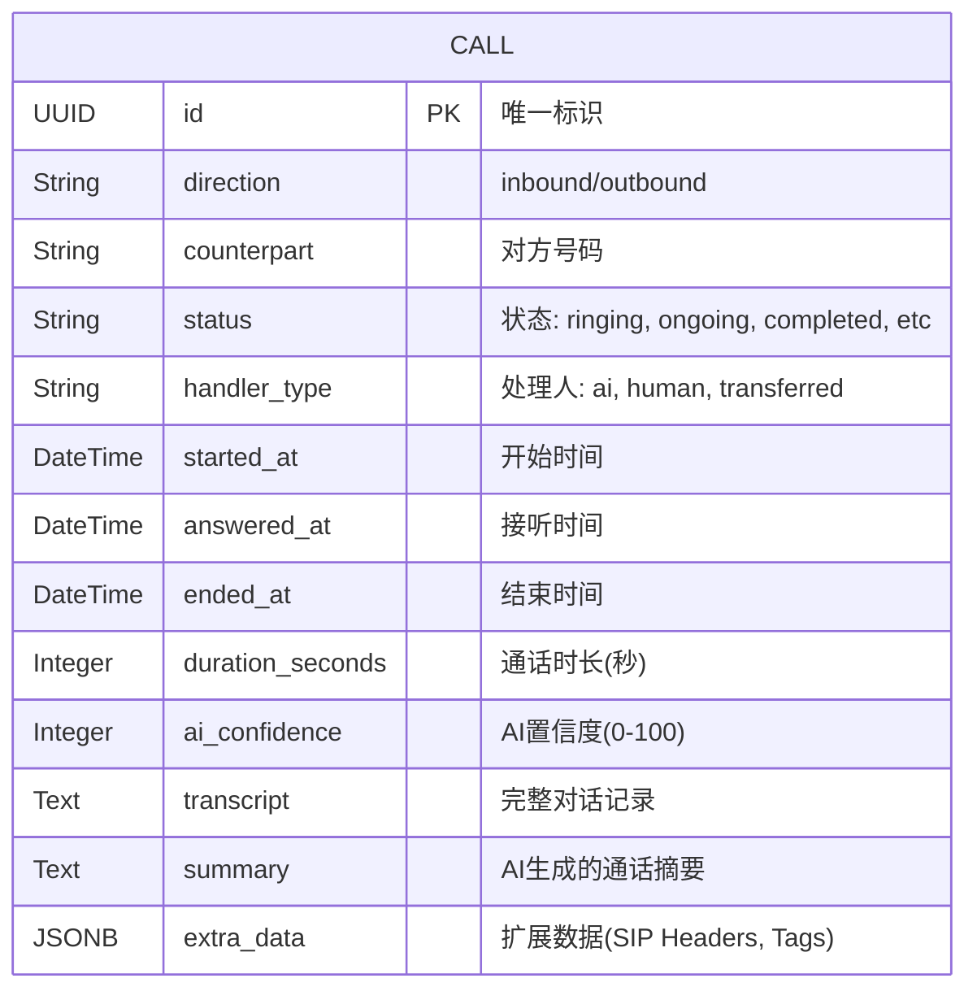
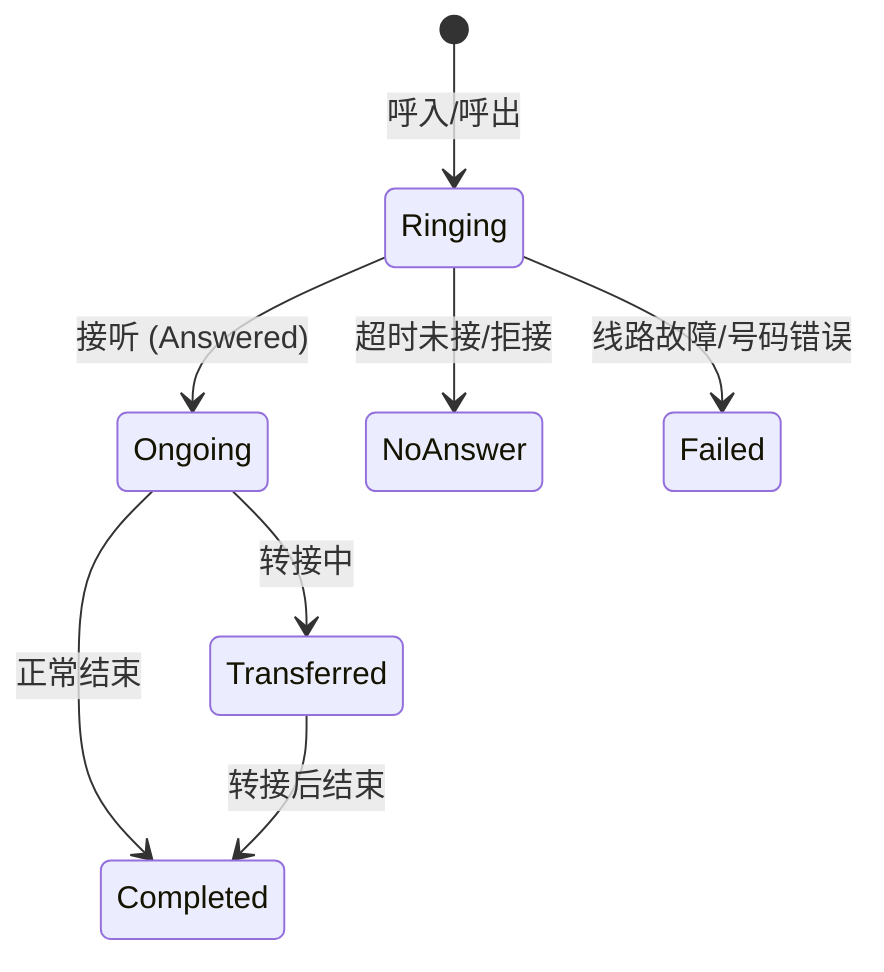

# 通话管理系统 (Call Management System) 设计文档

**版本**: 1.0.0
**状态**: 生产就绪 (Production Ready)
**维护者**: Backend Team

---

## 1. 业务概述

通话管理系统是 LLM Voice Agent 的核心模块，负责管理所有的语音通话生命周期。它不仅仅是一个简单的日志记录器，更是整个语音交互的"状态机"。

### 1.1 核心能力
*   **全生命周期追踪**: 从呼入/呼出(Ringing)到接听(Answered)、进行中(Ongoing)直至结束(Completed)的完整状态流转。
*   **混合智能处理**: 支持 AI 自主接听、人工接管、AI 转人工 (Human Handoff) 等多种业务模式。
*   **数据洞察**: 记录通话时长、AI 置信度 (Consultancy Score)、完整对话记录 (Transcript) 和业务摘要 (Summary)。
*   **高扩展性**: 通过 JSONB 类型的 `extra_data` 字段，支持不同场景（如 SIP 头信息、自定义业务标签）的动态扩展。

---

## 2. 系统架构

本模块采用分层架构 (Layered Architecture)，确保职责分离和可维护性。

```mermaid
graph TD
    Client[前端/客户端] --> API[API Layer (FastAPI)]
    API --> Service[Service Layer (Business Logic)]
    Service --> |CRUD操作| Repo[Repository Layer (SQLAlchemy)]
    Service --> |SIP信令| SIP[SIP/Telephony Adapter]
    Repo --> DB[(PostgreSQL Database)]
```

### 2.1 模块职责
*   **API Layer (`endpoints/calls.py`)**: 处理 HTTP 请求，参数校验，权限控制，响应格式化。
*   **Service Layer (`services/call_service.py`)**: 核心业务逻辑。处理状态流转、计算通话时长、生成摘要、触发后续工作流。
*   **Repository Layer (`repositories/call_repository.py`)**: 数据持久化抽象。处理分页、筛选、排序等数据库操作。
*   **Model Layer (`models/call.py`)**: 数据库实体定义。

---

## 3. 数据模型设计

### 3.1 实体关系图 (ERD)



### 3.2 关键字段说明

| 字段名 | 类型 | 说明 | 业务规则 |
| :--- | :--- | :--- | :--- |
| `id` | UUID | 主键 | 系统自动生成，全局唯一 |
| `direction` | Enum | 呼叫方向 | `inbound` (呼入) 或 `outbound` (呼出) |
| `status` | Enum | 当前状态 | 状态机流转控制 (见 4.1) |
| `handler_type` | Enum | 处理方式 | `ai` (全自动), `human` (人工), `transferred` (转接) |
| `ai_confidence` | Integer | AI置信度 | 0-100分。低于设定阈值(如70)可触发风险告警或人工复查 |
| `extra_data` | JSONB | 扩展元数据 | 存储 SIP Call ID, Twilio 回调参数, 场景标签等非结构化数据 |

---

## 4. 业务逻辑与状态机

### 4.1 通话状态流转



### 4.2 核心业务流程
1.  **呼叫初始化**: 创建 Call 记录，状态为 `ringing`。
2.  **接听处理**: 收到接听信号，更新状态为 `ongoing`，记录 `answered_at`。
3.  **转接逻辑 (Handoff)**:
    *   AI 判断无法处理或用户要求转人工。
    *   更新 `handler_type` 为 `transferred`。
    *   记录 `transferred_at` 和 `transfer_reason`。
4.  **结束归档**:
    *   通话挂断，更新状态为 `completed`。
    *   计算 `duration_seconds`。
    *   异步触发 LLM: 生成 `transcript` (转写) 和 `summary` (摘要)。
    *   异步计算 `ai_confidence`。

---

## 5. API 接口规范

设计遵循 RESTful 规范，所有接口前缀为 `/api/v1/calls`。

### 5.1 获取通话列表
`GET /api/v1/calls`

**请求参数**:
*   `page`: 页码 (默认 1)
*   `page_size`: 每页数量 (默认 20)
*   `sort_by`: 排序字段 (如 `started_at`)
*   `status`: 按状态筛选 (可选)
*   `search`: 搜索号码或姓名 (可选)

**响应示例**:
```json
{
  "success": true,
  "data": {
    "items": [
      {
        "id": "f1c83b67...",
        "direction": "inbound",
        "counterpart": "+1234567890",
        "status": "completed",
        "ai_confidence": 95,
        "extra_data": { "scenario": "sales_inquiry" }
      }
    ],
    "total": 100,
    "page": 1,
    "page_size": 20
  }
}
```

### 5.2 获取通话详情
`GET /api/v1/calls/{id}`

返回通话的完整信息，包括对话详情 (`transcript`) 和扩展数据。

---

## 6. 扩展性与未来规划

### 6.1 成本追踪 (Cost Tracking)
计划在 `extra_data` 或新增字段中加入：
*   `provider_cost`: 运营商(Twilio/SIP)费用
*   `llm_cost`: 大模型 Token 消耗费用
*   `stt_tts_cost`: 语音转文字/文字转语音费用

### 6.2 录音归档 (Call Recording)
*   集成对象存储 (S3/GCS)。
*   在 `Call` 模型中增加 `recording_url` 字段，存储签名的访问链接。

### 6.3 实时数据流 (WebSocket)
*   前端通过 WebSocket 订阅通话状态变更，实现 Dashboard 实时监控大屏。
