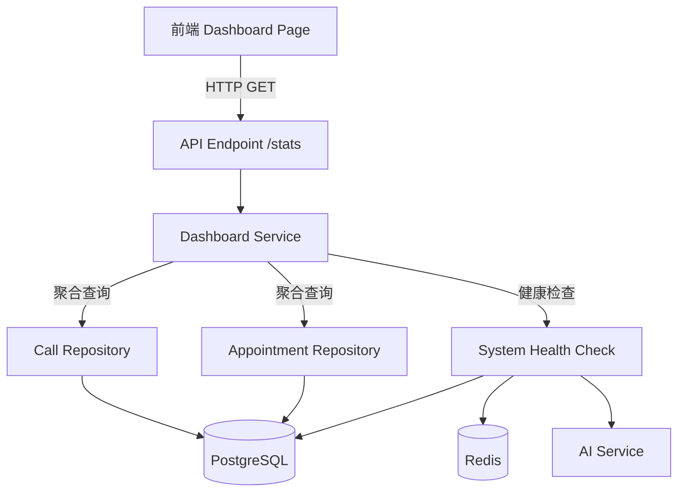
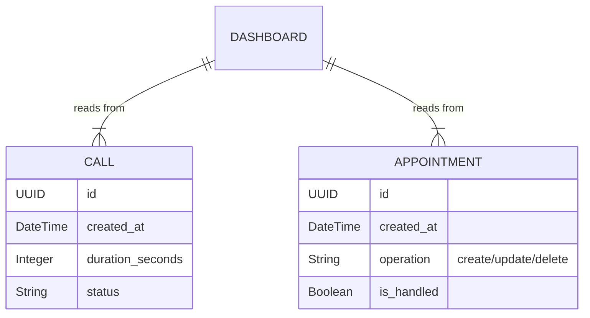

# 仪表盘系统 (Dashboard System) 设计文档

**版本**: 1.0.0  
**状态**: 生产就绪 (Production Ready)  
**维护者**: Backend Team

---

## 1. 业务概述

仪表盘系统是 LLM Voice Agent 的**数据洞察与决策支持中心**。它不是简单的数据展示页面，而是一个为预约管理业务量身定制的实时监控和分析系统。

### 1.1 核心能力
*   **实时监控**: 提供通话量、预约处理进度等核心业务指标的实时数据。
*   **预约管理中心**: 聚焦于待处理、新增、取消、变更等关键预约状态，帮助运营团队快速发现问题。
*   **趋势分析**: 通过7天趋势图，识别业务高峰和低谷，辅助资源调配决策。
*   **系统健康**: 实时监控 PostgreSQL、Redis、AI Service 的运行状态，确保服务可用性。

### 1.2 业务价值
*   **提高响应速度**: 待处理预约实时可见，确保客户需求得到及时处理。
*   **优化资源配置**: 通过趋势数据，合理安排人力和AI服务资源。
*   **风险预警**: 处理率过低或系统异常时，提供可视化告警。

---

## 2. 系统架构

Dashboard系统采用**无状态设计**，通过单一API端点提供所有必要的聚合数据，减少前端请求次数，提升加载速度。



### 2.1 模块职责
*   **API Layer (`endpoints/dashboard.py`)**: 
    - 提供单一`/stats`端点
    - 无需认证（内部系统）
    - 返回标准JSON格式
*   **Service Layer (`dashboard.py内部逻辑`)**: 
    - 聚合多张表的统计数据
    - 计算趋势百分比
    - 格式化时长显示
    - 生成趋势时间序列
*   **Data Layer**: 
    - 直接使用 SQLAlchemy ORM
    - 通过`func.count()`, `func.sum()`, `func.avg()`进行高效聚合

---

## 3. 数据模型设计

Dashboard**不拥有独立的数据表**，而是作为**数据消费者**，从`calls`和`appointments`表中读取和聚合数据。

### 3.1 数据依赖关系



### 3.2 关键聚合指标

| 指标分类 | 指标名称 | 数据来源 | 计算逻辑 |
| :--- | :--- | :--- | :--- |
| **通话统计** | 总通话数 | `calls` | `COUNT(*)` |
| | 今日通话 | `calls` | `COUNT(*) WHERE created_at >= today` |
| | 平均通话时长 | `calls` | `AVG(duration_seconds)` |
| | 总通话时长 | `calls` | `SUM(duration_seconds)` |
| | 通话趋势 | `calls` | `(今日 - 昨日) / 昨日 * 100` |
| **预约概览** | 总预约数 | `appointments` | `COUNT(*)` |
| | 今日预约 | `appointments` | `COUNT(*) WHERE created_at >= today` |
| | 待处理预约 | `appointments` | `COUNT(*) WHERE is_handled = FALSE` |
| | 新增预约 | `appointments` | `COUNT(*) WHERE operation='create' AND created_at >= today` |
| | 预约趋势 | `appointments` | `(今日 - 昨日) / 昨日 * 100` |
| **预约详情** | 已取消 | `appointments` | `COUNT(*) WHERE operation='delete'` |
| | 已变更 | `appointments` | `COUNT(*) WHERE operation='update'` |
| | 已完成 | `appointments` | `COUNT(*) WHERE is_handled = TRUE` |
| | 处理率 | `appointments` | `已完成 / 总数 * 100` |
| **趋势分析** | 7天趋势 | `calls` | `GROUP BY date_trunc('day', created_at)` |

---

## 4. API设计

### 4.1 获取Dashboard统计数据

**端点**: `GET /api/v1/dashboard/stats`

**描述**: 获取Dashboard所有统计指标（固定最近7天，天粒度）

**请求参数**: 无

**响应示例**:
```json
{
  "calls": {
    "total": 54,
    "today": 21,
    "avg_duration": "3:12",
    "total_duration": "2:53:22",
    "trend": 0.0
  },
  "appointments": {
    "total": 39,
    "today": 17,
    "pending": 32,
    "new_today": 4,
    "cancelled": 0,
    "rescheduled": 17,
    "completed": 7,
    "completion_rate": 17.9,
    "trend": 0.0
  },
  "trend": [
    {"date": "2026-02-03", "value": 0, "group": "通话数"},
    {"date": "2026-02-04", "value": 0, "group": "通话数"},
    {"date": "2026-02-05", "value": 20, "group": "通话数"},
    {"date": "2026-02-06", "value": 12, "group": "通话数"},
    {"date": "2026-02-07", "value": 0, "group": "通话数"},
    {"date": "2026-02-08", "value": 0, "group": "通话数"},
    {"date": "2026-02-09", "value": 0, "group": "通话数"},
    {"date": "2026-02-10", "value": 21, "group": "通话数"}
  ],
  "system_status": {
    "database": {
      "status": "healthy",
      "message": "连接正常"
    },
    "redis": {
      "status": "healthy",
      "message": "连接正常"
    },
    "ai_service": {
      "status": "healthy",
      "message": "服务正常"
    }
  }
}
```

**字段说明**:

| 字段路径 | 类型 | 说明 | 业务规则 |
| :--- | :--- | :--- | :--- |
| `calls.total` | Integer | 总通话数 | 所有历史通话记录数 |
| `calls.today` | Integer | 今日通话数 | 今日0点至当前时间 |
| `calls.avg_duration` | String | 平均通话时长 | 格式: "MM:SS" 或 "H:MM:SS" |
| `calls.total_duration` | String | 总通话时长 | 所有通话累计时长 |
| `calls.trend` | Float | 通话趋势 | 百分比，正数上升，负数下降 |
| `appointments.pending` | Integer | 待处理预约 | `is_handled = FALSE`的数量 |
| `appointments.new_today` | Integer | 今日新增 | `operation='create'` 且今日创建 |
| `appointments.cancelled` | Integer | 已取消 | `operation='delete'` |
| `appointments.rescheduled` | Integer | 已变更 | `operation='update'` |
| `appointments.completed` | Integer | 已完成 | `is_handled = TRUE` |
| `appointments.completion_rate` | Float | 处理率 | `已完成 / 总数 * 100` |
| `trend[]` | Array | 趋势数据 | 最近7天每日通话数 |
| `trend[].date` | String | 日期 | ISO格式 "YYYY-MM-DD" |
| `trend[].value` | Integer | 通话数 | 当日通话总数 |
| `trend[].group` | String | 分组 | 固定为 "通话数" |
| `system_status.*` | Object | 系统状态 | 各服务健康检查结果 |

**状态码**:
*   `200 OK`: 成功返回数据
*   `500 Internal Server Error`: 数据库连接失败或查询错误

---

## 5. 业务逻辑设计

### 5.1 时长格式化算法

```python
def _format_duration(seconds: int) -> str:
    """
    将秒数格式化为人类可读的时长字符串
    
    规则:
    - 0秒: "0:00"
    - < 1小时: "MM:SS"  (如 "3:45")
    - >= 1小时: "H:MM:SS" (如 "2:15:30")
    """
    if seconds == 0:
        return "0:00"
    
    hours = seconds // 3600
    minutes = (seconds % 3600) // 60
    secs = seconds % 60
    
    if hours > 0:
        return f"{hours}:{minutes:02d}:{secs:02d}"
    else:
        return f"{minutes}:{secs:02d}"
```

### 5.2 趋势数据生成

```python
def _generate_daily_trend(db: Session, start: datetime, end: datetime) -> list:
    """
    生成每日通话趋势数据
    
    步骤:
    1. 使用 date_trunc('day', created_at) 按天分组
    2. 计数每天的通话数
    3. 填充缺失日期（值为0）
    4. 返回时间序列数组
    """
    # SQL: SELECT date_trunc('day', created_at) as day, COUNT(*) 
    #      FROM calls 
    #      WHERE created_at >= start AND created_at <= end
    #      GROUP BY date_trunc('day', created_at)
    #      ORDER BY day
    
    # 填充所有日期，包括没有数据的日期
```

### 5.3 趋势百分比计算

**公式**: `trend_percent = (今日数量 - 昨日数量) / 昨日数量 * 100`

**边界情况**:
*   昨日数量为0时，trend返回`0`（避免除零错误）
*   四舍五入保留1位小数

### 5.4 系统健康检查

**检查项**:
1.  **PostgreSQL**: 执行`SELECT 1`测试连接
2.  **Redis**: 调用`ping()`方法（TODO: 当前为模拟数据）
3.  **AI Service**: 调用健康检查端点（TODO: 当前为模拟数据）

**返回格式**:
```python
{
    "status": "healthy" | "error" | "warning",
    "message": "具体状态信息"
}
```

---

## 6. 性能优化策略

### 6.1 查询优化
*   **单次聚合**: 所有统计指标通过独立的`COUNT/SUM/AVG`查询获取，避免过度Join
*   **索引利用**: 利用`created_at`字段的索引加速时间范围查询
*   **结果缓存**: 前端使用React Query进行30秒staleTime缓存

### 6.2 数据量控制
*   **固定时间窗口**: 趋势数据固定为7天，避免大数据集查询
*   **最大数据点**: 趋势图最多8个数据点（7天+今天部分）

### 6.3 并发处理
*   **无状态设计**: Dashboard API无需Session，支持高并发
*   **只读查询**: 所有查询均为SELECT，不修改数据，可无限扩展只读副本

---

## 7. 前后端交互约定

### 7.1 前端Hook设计

```typescript
// Hook: useDashboardStats()
export function useDashboardStats(
  enabled: boolean = true,
  refetchInterval: number = 60000  // 默认60秒自动刷新
): UseQueryResult<DashboardStats, Error>
```

**特性**:
*   自动60秒轮询刷新
*   30秒staleTime防止频繁请求
*   placeholderData保持旧数据，避免闪烁

### 7.2 StatCard组件接口

```typescript
interface StatCardProps {
  label: string;        // 指标名称
  value: string | number;  // 显示值
  trend?: number;       // 趋势百分比（可选）
  trendLabel?: string;  // 趋势描述（可选）
  loading?: boolean;    // 加载状态
}
```

**注意事项**:
*   不支持`icon`属性
*   不支持`status`属性
*   不支持`valueType`属性

### 7.3 StatusIndicator组件接口

```typescript
interface StatusIndicatorProps {
  label: string;     // 服务名称
  status: 'online' | 'warning' | 'error' | 'unknown';
  details?: string;  // 详细信息（注意: 不是message）
  compact?: boolean; // 紧凑模式
}
```

---

## 8. 常见问题与最佳实践

### 8.1 字段名错误

**问题**: `Call.duration` vs `Call.duration_seconds`

**解决方案**: 始终使用完整字段名`duration_seconds`

```python
# ✅ 正确
avg_duration = db.query(func.avg(Call.duration_seconds)).scalar()

# ❌ 错误
avg_duration = db.query(func.avg(Call.duration)).scalar()
```

### 8.2 Boolean查询语法

**问题**: SQLAlchemy中Boolean比较需要使用`.is_()`

**解决方案**:
```python
# ✅ 正确
pending = db.query(...).filter(Appointment.is_handled.is_(False)).scalar()

# ❌ 错误
pending = db.query(...).filter(Appointment.is_handled == False).scalar()
```

### 8.3 时区一致性

**最佳实践**: 所有时间使用UTC时区

```python
now = datetime.now(timezone.utc)  # 始终使用UTC
today_start = now.replace(hour=0, minute=0, second=0, microsecond=0)
```

### 8.4 组件Props类型匹配

**问题**: 前端组件props与使用不匹配导致TypeScript错误

**解决方案**: 严格遵循组件接口定义
*   StatCard使用`label`而非`title`
*   StatusIndicator使用`details`而非`message`
*   StatusType使用`'online'`而非`'success'`

---

## 9. 未来扩展计划

### 9.1 短期优化 (1-2周)
- [ ] 完善Redis和AI Service的实际健康检查
- [ ] 添加日志记录，便于问题排查
- [ ] 实现数据缓存机制（Redis）

### 9.2 中期增强 (1-3个月)
- [ ] 添加更多维度的趋势分析（按小时、按处理人等）
- [ ] 实现告警阈值配置（如待处理预约>50时发送通知）
- [ ] 导出数据功能（Excel/CSV）

### 9.3 长期规划 (3-6个月)
- [ ] BI集成（接入Metabase/Superset）
- [ ] 自定义Dashboard布局
- [ ] 多租户支持（不同客户看到不同数据）

---

## 10. 版本历史

| 版本 | 日期 | 变更内容 | 作者 |
| :--- | :--- | :--- | :--- |
| 1.0.0 | 2026-02-10 | 初始版本，定义核心API和数据模型 | Backend Team |

---

## 11. 相关文档

*   [通话管理系统设计文档](./call_system_design.md)
*   [预约管理系统设计文档](./appointment_system_design.md)
*   [Frontend Dashboard Component文档](../../frontend/docs/Dashboard.md)

---

**文档状态**: ✅ 已审核  
**最后更新**: 2026-02-10
