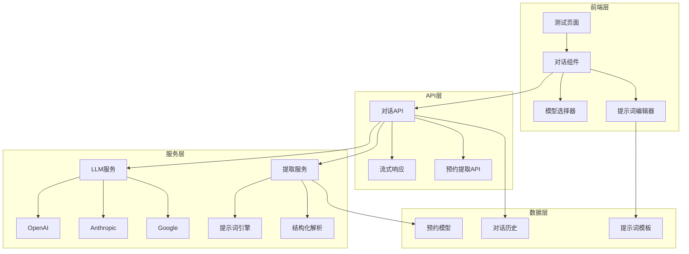
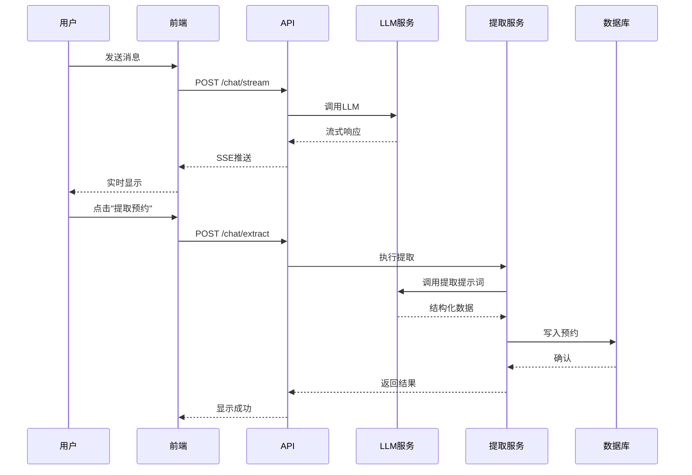

# LLM对话预约提取系统 - 企业级设计文档

## 1. 系统概述

### 1.1 业务目标
通过LLM对话界面,用户可以与AI模型进行自然语言交互,系统自动提取对话中的预约信息并写入数据库,实现智能化的预约管理。

### 1.2 核心功能
- 🤖 **多模型支持**: 支持OpenAI、Anthropic、Google等主流LLM
- 💬 **实时对话**: 流式响应,提升用户体验
- 🎯 **智能提取**: 基于提示词工程自动提取预约信息
- 📊 **数据持久化**: 提取的预约自动写入数据库
- 🔧 **灵活配置**: 支持自定义提示词模板

### 1.3 技术栈
- **后端**: FastAPI + LangChain + SQLAlchemy
- **前端**: React + Carbon Design + React Query
- **LLM**: OpenAI API / Anthropic API / Google Gemini
- **数据库**: PostgreSQL

---

## 2. 系统架构

### 2.1 整体架构



### 2.2 数据流程



---

## 3. 数据库设计

### 3.1 对话历史表 (chat_sessions)

```sql
CREATE TABLE chat_sessions (
    id UUID PRIMARY KEY DEFAULT gen_random_uuid(),
    user_id VARCHAR(255),
    model_name VARCHAR(100) NOT NULL,
    system_prompt TEXT,
    created_at TIMESTAMP WITH TIME ZONE DEFAULT NOW(),
    updated_at TIMESTAMP WITH TIME ZONE DEFAULT NOW()
);

CREATE TABLE chat_messages (
    id UUID PRIMARY KEY DEFAULT gen_random_uuid(),
    session_id UUID REFERENCES chat_sessions(id) ON DELETE CASCADE,
    role VARCHAR(20) NOT NULL,  -- 'user' | 'assistant' | 'system'
    content TEXT NOT NULL,
    tokens_used INTEGER,
    created_at TIMESTAMP WITH TIME ZONE DEFAULT NOW()
);

CREATE INDEX idx_chat_messages_session ON chat_messages(session_id);
```

### 3.2 提示词模板表 (prompt_templates)

```sql
CREATE TABLE prompt_templates (
    id UUID PRIMARY KEY DEFAULT gen_random_uuid(),
    name VARCHAR(255) NOT NULL,
    description TEXT,
    template_type VARCHAR(50) NOT NULL,  -- 'extraction' | 'chat' | 'system'
    content TEXT NOT NULL,
    variables JSONB,  -- 模板变量定义
    is_active BOOLEAN DEFAULT true,
    created_at TIMESTAMP WITH TIME ZONE DEFAULT NOW(),
    updated_at TIMESTAMP WITH TIME ZONE DEFAULT NOW()
);
```

### 3.3 扩展预约表 (appointments)

```sql
-- 添加来源字段
ALTER TABLE appointments 
ADD COLUMN source VARCHAR(50) DEFAULT 'phone',  -- 'phone' | 'chat' | 'manual'
ADD COLUMN chat_session_id UUID REFERENCES chat_sessions(id),
ADD COLUMN extraction_confidence FLOAT;  -- 提取置信度 0-1
```

---

## 4. API设计

### 4.1 对话API

#### POST /api/v1/chat/stream
**功能**: 流式对话

**请求体**:
```json
{
  "session_id": "uuid",
  "message": "我想预约明天下午3点的会议室",
  "model": "gpt-4",
  "system_prompt": "你是一个预约助手..."
}
```

**响应**: Server-Sent Events (SSE)
```
data: {"type": "token", "content": "好的"}
data: {"type": "token", "content": "，"}
data: {"type": "done", "session_id": "uuid"}
```

#### POST /api/v1/chat/extract
**功能**: 从对话中提取预约信息

**请求体**:
```json
{
  "session_id": "uuid",
  "template_id": "uuid"  // 可选,使用指定模板
}
```

**响应**:
```json
{
  "success": true,
  "appointment": {
    "id": "uuid",
    "timestamp": "2026-02-13T15:00:00Z",
    "caller_name": "张三",
    "company": "ABC公司",
    "appointment": "会议室预约",
    "category": "会议",
    "summary": "预约明天下午3点的会议室",
    "extraction_confidence": 0.95
  },
  "extracted_fields": {
    "date": "明天",
    "time": "下午3点",
    "purpose": "会议室预约"
  }
}
```

### 4.2 模板管理API

#### GET /api/v1/prompts/templates
**功能**: 获取提示词模板列表

#### POST /api/v1/prompts/templates
**功能**: 创建提示词模板

#### PUT /api/v1/prompts/templates/{id}
**功能**: 更新提示词模板

---

## 5. LLM服务设计

### 5.1 服务抽象层

```python
# app/services/llm/base.py
from abc import ABC, abstractmethod
from typing import AsyncIterator, Dict, Any

class BaseLLMService(ABC):
    """LLM服务基类"""
    
    @abstractmethod
    async def chat_stream(
        self,
        messages: list[Dict[str, str]],
        **kwargs
    ) -> AsyncIterator[str]:
        """流式对话"""
        pass
    
    @abstractmethod
    async def chat_completion(
        self,
        messages: list[Dict[str, str]],
        **kwargs
    ) -> str:
        """完整对话"""
        pass
```

### 5.2 OpenAI实现

```python
# app/services/llm/openai_service.py
from openai import AsyncOpenAI
from .base import BaseLLMService

class OpenAIService(BaseLLMService):
    def __init__(self, api_key: str):
        self.client = AsyncOpenAI(api_key=api_key)
    
    async def chat_stream(
        self,
        messages: list[Dict[str, str]],
        model: str = "gpt-4",
        **kwargs
    ) -> AsyncIterator[str]:
        stream = await self.client.chat.completions.create(
            model=model,
            messages=messages,
            stream=True,
            **kwargs
        )
        async for chunk in stream:
            if chunk.choices[0].delta.content:
                yield chunk.choices[0].delta.content
```

### 5.3 提取服务

```python
# app/services/extraction_service.py
from typing import Optional
from pydantic import BaseModel

class AppointmentExtraction(BaseModel):
    """提取的预约信息"""
    timestamp: str
    caller_name: Optional[str]
    company: Optional[str]
    appointment: str
    category: Optional[str]
    summary: str
    confidence: float

class ExtractionService:
    """预约信息提取服务"""
    
    def __init__(self, llm_service: BaseLLMService):
        self.llm = llm_service
    
    async def extract_appointment(
        self,
        conversation: list[Dict[str, str]],
        template: str
    ) -> AppointmentExtraction:
        """从对话中提取预约信息"""
        
        # 构建提取提示词
        extraction_prompt = self._build_extraction_prompt(
            conversation, 
            template
        )
        
        # 调用LLM
        response = await self.llm.chat_completion(
            messages=[
                {"role": "system", "content": extraction_prompt},
                {"role": "user", "content": "请提取预约信息"}
            ],
            response_format={"type": "json_object"}
        )
        
        # 解析JSON
        data = json.loads(response)
        return AppointmentExtraction(**data)
```

---

## 6. 提示词工程

### 6.1 系统提示词模板

```python
SYSTEM_PROMPT = """你是一个专业的预约助手。你的任务是:
1. 理解用户的预约需求
2. 询问必要的信息(时间、姓名、公司、预约内容等)
3. 确认预约详情
4. 保持友好和专业的态度

当前时间: {current_time}
可用时间段: {available_slots}

请用简洁、清晰的语言与用户交流。
"""
```

### 6.2 提取提示词模板

```python
EXTRACTION_PROMPT = """请从以下对话中提取预约信息,以JSON格式返回。

对话历史:
{conversation}

请提取以下字段:
- timestamp: 预约时间(ISO 8601格式)
- caller_name: 预约人姓名
- company: 公司名称
- appointment: 预约内容
- category: 预约类别(会议/咨询/服务等)
- summary: 预约摘要
- confidence: 提取置信度(0-1)

如果某个字段无法确定,请设为null。
确保timestamp是有效的日期时间。

返回格式:
{
  "timestamp": "2026-02-13T15:00:00+09:00",
  "caller_name": "张三",
  "company": "ABC公司",
  "appointment": "会议室预约",
  "category": "会议",
  "summary": "预约明天下午3点的会议室,用于项目讨论",
  "confidence": 0.95
}
"""
```

---

## 7. 前端设计

### 7.1 组件结构

```
src/components/organisms/ChatInterface/
├── ChatInterface.tsx          # 主容器
├── ChatInterface.module.scss
├── MessageList.tsx            # 消息列表
├── MessageInput.tsx           # 输入框
├── ModelSelector.tsx          # 模型选择器
├── PromptEditor.tsx           # 提示词编辑器
└── ExtractionPanel.tsx        # 提取结果面板
```

### 7.2 核心组件

```tsx
// ChatInterface.tsx
export function ChatInterface() {
  const [messages, setMessages] = useState<Message[]>([]);
  const [selectedModel, setSelectedModel] = useState('gpt-4');
  const [systemPrompt, setSystemPrompt] = useState(DEFAULT_PROMPT);
  
  const { mutate: sendMessage, isLoading } = useMutation({
    mutationFn: (message: string) => 
      chatAPI.streamMessage(sessionId, message, selectedModel),
    onSuccess: (stream) => {
      // 处理流式响应
      handleStream(stream);
    }
  });
  
  const { mutate: extractAppointment } = useMutation({
    mutationFn: () => chatAPI.extractAppointment(sessionId),
    onSuccess: (appointment) => {
      // 显示提取结果
      showExtraction(appointment);
    }
  });
  
  return (
    <div className={styles.container}>
      <div className={styles.header}>
        <ModelSelector 
          value={selectedModel}
          onChange={setSelectedModel}
        />
        <PromptEditor
          value={systemPrompt}
          onChange={setSystemPrompt}
        />
      </div>
      
      <MessageList messages={messages} />
      
      <MessageInput 
        onSend={sendMessage}
        disabled={isLoading}
      />
      
      <div className={styles.actions}>
        <Button onClick={() => extractAppointment()}>
          提取预约信息
        </Button>
      </div>
    </div>
  );
}
```

---

## 8. 安全性设计

### 8.1 API密钥管理
- 使用环境变量存储API密钥
- 支持密钥轮换
- 实现速率限制

### 8.2 输入验证
- 消息长度限制
- 内容过滤(敏感词)
- SQL注入防护

### 8.3 成本控制
- Token使用统计
- 每日配额限制
- 异常检测告警

---

## 9. 监控与日志

### 9.1 关键指标
- LLM调用次数
- 平均响应时间
- Token消耗量
- 提取成功率
- 提取置信度分布

### 9.2 日志记录
```python
logger.info(
    "LLM extraction completed",
    extra={
        "session_id": session_id,
        "model": model_name,
        "tokens_used": tokens,
        "confidence": confidence,
        "success": success
    }
)
```

---

## 10. 实施计划

### 阶段1: 基础设施 (1周)
- [ ] 数据库表创建
- [ ] LLM服务抽象层
- [ ] OpenAI集成

### 阶段2: 后端API (1周)
- [ ] 对话API实现
- [ ] 提取API实现
- [ ] 模板管理API

### 阶段3: 前端开发 (1周)
- [ ] 对话界面组件
- [ ] 模型选择器
- [ ] 提示词编辑器
- [ ] 集成到测试页面

### 阶段4: 测试优化 (3天)
- [ ] 单元测试
- [ ] 集成测试
- [ ] 性能优化
- [ ] 文档完善

---

## 11. 成本估算

### 11.1 LLM成本
- GPT-4: ~$0.03/1K tokens (输入) + $0.06/1K tokens (输出)
- GPT-3.5: ~$0.001/1K tokens
- 预估月成本: $50-200 (取决于使用量)

### 11.2 开发成本
- 后端开发: 2周
- 前端开发: 1周
- 测试优化: 3天
- 总计: 约3.5周

---

## 12. 风险与应对

| 风险 | 影响 | 应对措施 |
|-----|------|---------|
| LLM提取准确率低 | 高 | 优化提示词,增加人工审核 |
| API成本超预算 | 中 | 实施配额限制,使用缓存 |
| 响应延迟高 | 中 | 使用流式响应,优化提示词 |
| 数据隐私问题 | 高 | 数据脱敏,本地部署选项 |

---

## 13. 未来扩展

- 🌐 **多语言支持**: 支持英语、日语对话
- 🎙️ **语音输入**: 集成语音识别
- 📱 **移动端**: 开发移动应用
- 🤝 **多轮对话**: 支持复杂预约场景
- 📊 **分析报表**: 对话质量分析

---

## 附录

### A. 参考资料
- [OpenAI API文档](https://platform.openai.com/docs)
- [LangChain文档](https://python.langchain.com/)
- [FastAPI SSE](https://fastapi.tiangolo.com/advanced/custom-response/)

### B. 示例代码仓库
- 完整实现代码将在 `feature/llm-chat` 分支

### C. 联系方式
- 技术负责人: [待定]
- 产品负责人: [待定]
