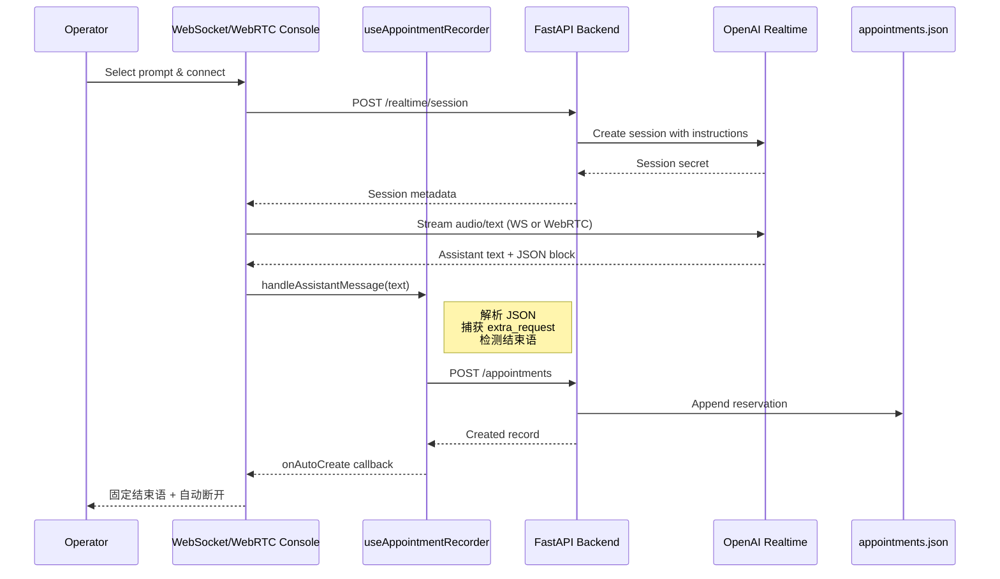

# LLM Voice Agent Architecture

## Overview
The project provides a modular platform for inbound and outbound telephony experiences that are orchestrated by large language models (LLMs). It is split into a React + TypeScript dashboard and a Python service layer. Both surfaces communicate through a well-defined REST API, making it straightforward to swap providers or scale components independently.

### Deployment mode
- 当前阶段采用**模块化单体**：FastAPI 应用内部通过 `core/services/repositories` 分层完成解耦，并暴露 `/api` 接口供 React dashboard 调用。
- 需要异步解耦时，可先引入消息队列/任务队列中间件，把 telephony webhook、LLM 推理流程异步化，而不是立即拆成多个微服务。
- 随着并发和团队规模增长，可以把 `telephony`、`llm-orchestrator`、`analytics` 等模块提取为独立服务；由于代码组织已经遵循依赖倒置，迁移时不必大拆大改。

```
frontend (React + Vite)
├─ src/
│  ├─ pages/
│  ├─ components/
│  ├─ state/
│  ├─ api/
│  └─ types/
└─ tests/

backend (FastAPI)
├─ app/
│  ├─ api/v1/        # 路由层，聚合 REST 接口
│  ├─ services/      # 领域逻辑 (call flow, telephony, llm, prompts)
│  ├─ repositories/  # 数据访问与持久化抽象
│  ├─ schemas/       # Pydantic 模型
│  └─ core/          # 配置、启动依赖
└─ tests/
```

## Key Concepts
- **Telephony adapters** encapsulate integrations for placing/receiving calls (e.g., Twilio, SIP). They expose a consistent interface consumed by the call flow service.
- **LLM orchestration** defines prompt templates, session memory, and tool usage. The interface makes it trivial to switch between providers or models.
- **Call flows** coordinate telephony events, persistence, and LLM prompts. They log every interaction for later review in the dashboard.
- **Dashboard** surfaces call history, prompt configurations, agent status, and webhook health checks。UI 采用 IBM Carbon Design System（`@carbon/react` + UIShell），保证企业级一致性。
- **Persistence** uses a repository pattern. By default it ships with an in-memory store but can be swapped for Postgres or any ORM implementation without touching business logic.

## Prompt Builder Pipeline
Prompt templates live in `backend/data/prompts.json` and are loaded through the repository/service layer. Every response from `/api/prompts` is enriched with synthesized instructions so both WebSocket 与 WebRTC 控制台始终获得统一提示。


`prompt_builder.py` 会将系统提示、欢迎语、语音配置及预约提示拼入一段英文指令，确保同一个模型在不同通道（WebSocket/WebRTC/SIP）下遵循相同流程：主动询问追加要望、产出 JSON 代码块、播报固定结束语，然后静默等待前端自动断线。

## Realtime Testing Consoles
`frontend/src/features/test/components` 提供三个调试面板。WebSocketConsole 使用 OpenAI Realtime WebSocket，WebRtcConsole 通过浏览器 `RTCPeerConnection` 处理音频流和 DataChannel，SipConsole 生成 SIP 会话凭证。两种主要通道共享同一预约记录逻辑（`useAppointmentRecorder`），因此：

- 选定 Prompt 后，通过 `/realtime/session` 申请临时密钥。服务端根据 channel 选择 VAD 策略，并注入前文构造的 instructions。
- 前端发起 WS 或 WebRTC 连接，把实时文本转交给 `sanitizeAssistantContent` 过滤，避免 JSON/系统提示出现在 UI/TTS。
- 只要模型输出符合规范的 JSON 代码块（operation + timestamp + extra_request 等字段），hook 会自动解析并准备持久化；若检测到固定结束语则触发自动保存与断线。
- UI 仍保留“生成预约记录”按钮，方便人工补录或测试无自动触发场景。



## Appointment Logging Workflow
- `frontend/src/features/test/utils/appointment.ts` 负责从助手文本里提取 JSON，并标准化 operation / extra_request 字段。
- `useAppointmentRecorder` 持有最新结构化结果，既支持人工点击“生成预约记录”，也能在检测到 JSON 或结束语时触发自动写库。
- `POST /appointments` 最终由 `AppointmentService` 将记录存入 `backend/data/appointments.json`，同时返回 ID 供前端刷新预约一览。

这一机制保证了“光洲産業自動受付AI” Prompt 在任何媒介里都遵循一致的业务流程，而且新增更新/删除预约等能力时只需扩展 JSON schema 与解析逻辑即可。

## Data Model Snapshot
- `CallLog`: metadata about the call, caller/callee info, timestamps, transcript summary, status, cost metrics.
- `PromptTemplate`: name, system prompt, sample responses, version history.
- `AgentProfile`: runtime configuration for inbound/outbound agents (LLM provider, voice, telemetry flags).

## API Surface (initial)
- `GET /health` — readiness/liveness for probes.
- `GET /calls` — list paginated call logs.
- `POST /calls/outbound` — kick off a proactive call with prompt + callee metadata.
- `POST /webhooks/telephony` — receives webhook callbacks (answer, hangup, speech events).
- `GET/PUT /prompts` — browse and edit prompt templates.

## Extensibility Hooks
- `TelephonyAdapter` abstract class for vendor-specific behavior.
- `LLMClient` interface to connect to OpenAI, Anthropic, Azure OpenAI, etc.
- Plug-in style registry for analytics/speech features in `services/call_flow.py`.
- Frontend environment-driven feature flags for staging/beta modules.

Refer to the README for setup instructions.
