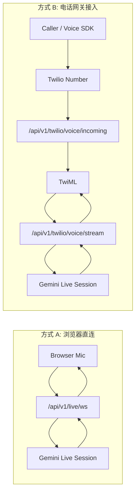

# 语音连接测试与 Gemini Live 架构（企业实现）

## 1. 目标与边界
- 本系统的语音核心是 **Gemini Live 会话**，不是 Twilio。
- Twilio 仅作为“电话网关接入方式”，用于 PSTN 呼入/呼出。
- 语音测试页面的核心目标是：验证“能连通、能收音、能转写、能回复、多轮可持续”。

## 2. 接入方式

### 2.1 方式 A（推荐）: 浏览器直连 Gemini Live
- 链路: Browser Mic -> `/api/v1/live/ws` -> Gemini Live
- 用途: 最快定位语音理解/对话问题，不受电信网络干扰。
- 优点: 调试成本最低，回归速度快。

### 2.2 方式 B（电话网关）: Twilio + Gemini Live
- 链路: PSTN/Twilio Voice SDK -> Twilio Number -> `/api/v1/twilio/voice/incoming` -> Media Stream -> Gemini Live
- 用途: 端到端电话场景回归。
- 定位: 这是“接入层验证”，不是模型能力验证的首选入口。

## 3. 对话模式（关键）

### 3.1 A 模式（默认）: Gemini 自动 Activity Detection
- 原则: **持续发送 `audio_chunk`**，由 Gemini Live 自动判定回合边界。
- 前端不再手动发送 `activity_start` / `activity_end`。
- `audio_end` 仅在用户明确停止麦克风或会话关闭时发送。

### 3.2 手动模式（仅调试）
- 仅在排查极端噪声或特定设备问题时启用。
- 手动模式下可发送 `activity_start` / `activity_end`。
- 不可与自动模式混用，否则容易出现“只回复一句/回合卡死”。

## 4. 运行时控制面

### 4.1 Prompt 与模型
- Prompt 模板决定:
  - `system_prompt`
  - `llm_provider`
  - `llm_model`
  - `voice_id`（可选）
- 语音测试页可覆盖音色；留空则回落到 Prompt/后端默认。

### 4.2 Twilio 入站路由
- Voice URL 示例:
  - `https://<ngrok>/api/v1/twilio/voice/incoming?mode=agent&voice_engine=gemini`
- 引擎解析优先级:
  1. query `voice_engine`
  2. `TWILIO_INCOMING_VOICE_ENGINE`

### 4.3 Prompt 解析优先级（入站）
1. query `prompt_code`
2. `TWILIO_INCOMING_PROMPT_MAP`
3. `TWILIO_DEFAULT_PROMPT_CODE`

## 5. 高层架构

## 6. 关键工程约束
- 单会话只允许一种回合控制策略（自动或手动），严禁混用。
- 语音链路的可观测性必须包含:
  - 会话建立事件
  - 输入/输出转写
  - turn complete / interrupted
  - 音频输入是否持续（chunk 计数）
- 生产路径启用 Twilio Webhook 验签:
  - `TWILIO_VALIDATE_WEBHOOKS=true`

## 7. 配置清单
- `TWILIO_INCOMING_VOICE_ENGINE=twilio|gemini`
- `TWILIO_GEMINI_ACTIVITY_MODE=auto|manual`
- `TWILIO_DEFAULT_PROMPT_CODE=base_appointment`
- `TWILIO_INCOMING_PROMPT_MAP=+8150xxxx:base_appointment`
- `TWILIO_STRICT_TEMPLATE_PROVIDER=true`

## 8. 回归顺序（建议）
1. 先跑方式 A（浏览器直连）验证多轮对话稳定性。
2. 再跑方式 B（Twilio 电话网关）验证 PSTN 端到端。
3. 对比两者转写质量、打断表现、平均首包时延。
4. 仅在方式 A 稳定后，放量电话入口。
