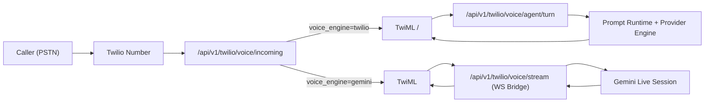
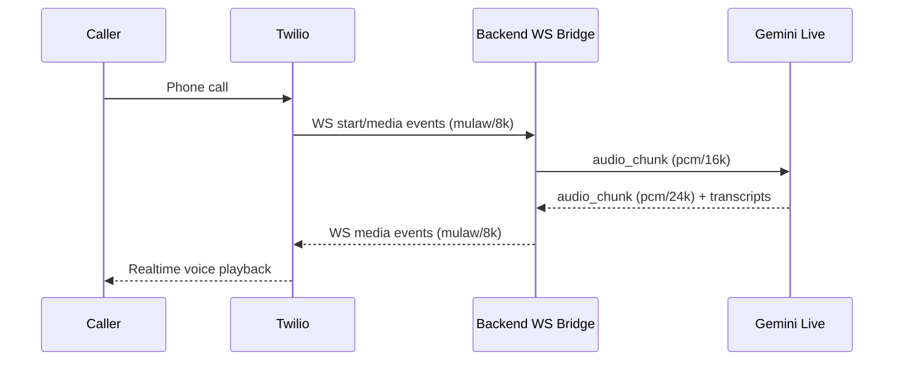

# Twilio Inbound Voice Engine Architecture

## Goal
- Twilio only handles telephony ingress/egress.
- AI conversation engine is selectable per inbound flow (`twilio` or `gemini`).
- Prompt template controls `llm_provider/llm_model/system_prompt`.
- No silent fallback across providers in production path.

## Runtime Modes
- `voice_engine=twilio`: Legacy `<Gather>` + `<Say>` loop (Twilio ASR/TTS, backend LLM text generation).
- `voice_engine=gemini`: Twilio Media Stream bridge to Gemini Live (Google handles realtime understanding + speech generation).

### Gemini Turn Segmentation
- `TWILIO_GEMINI_ACTIVITY_MODE=auto` (recommended): rely on Gemini Live automatic activity detection.
- `TWILIO_GEMINI_ACTIVITY_MODE=manual`: backend VAD + explicit `ActivityEnd` signals (debug fallback only).

## High-Level Architecture

## Gemini Stream Sequence

## Control Plane Rules
- Inbound prompt resolution priority:
  1. `prompt_code` query parameter
  2. `TWILIO_INCOMING_PROMPT_MAP`
  3. `TWILIO_DEFAULT_PROMPT_CODE`
- Voice engine resolution:
  1. `voice_engine` query parameter
  2. `TWILIO_INCOMING_VOICE_ENGINE` (default)
- Gemini stream mode requires resolved provider to be `gemini`.

## Enterprise Guardrails
- Webhook signature validation enabled (`TWILIO_VALIDATE_WEBHOOKS=true`).
- Explicit provider availability checks before stream connect.
- Prompt template lookup is server-side only; client does not choose provider directly.
- Structured logs include `CallSid`, engine, prompt code, provider, model.
- No implicit provider downgrade when strict template-provider mode is enabled.

## Configuration
- Inbound number Voice URL example:
  - `https://<your-ngrok>/api/v1/twilio/voice/incoming?mode=agent&voice_engine=gemini`
- Env switches:
  - `TWILIO_INCOMING_VOICE_ENGINE=twilio|gemini`
  - `TWILIO_GEMINI_ACTIVITY_MODE=auto|manual`
  - `TWILIO_DEFAULT_PROMPT_CODE=base_appointment`
  - `TWILIO_INCOMING_PROMPT_MAP=+8150xxxx:base_appointment`
  - `TWILIO_STRICT_TEMPLATE_PROVIDER=true`

## Rollout Plan
1. Keep default `voice_engine=twilio` for baseline stability.
2. Enable `voice_engine=gemini` on one test number.
3. Observe call success rate, latency, interruption behavior, and transcript quality.
4. Promote to production number after SLO pass.
