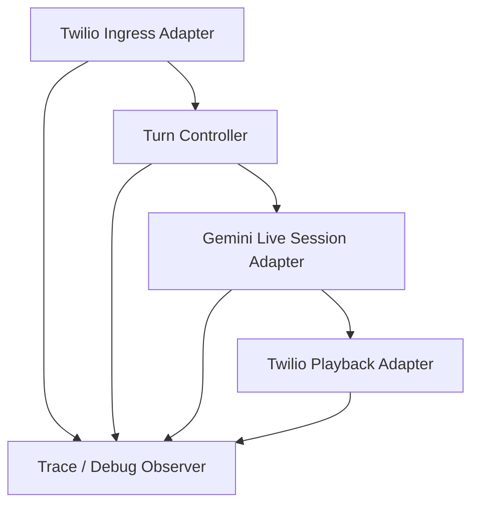

# Twilio Media Stream V2 Refactor

## 背景

当前自建 `Twilio Media Streams + Gemini Live` 链路之所以难维护，不是因为某一个阈值难调，而是因为一条链里同时混入了三类职责：

- 传输层：Twilio WebSocket / Gemini Live WebSocket / 音频转码
- 回合控制：manual activity、barge-in、playback mark、turn commit
- 诊断观察：followup probe、debug wav、trace diagnostics

这些职责都堆进 [backend/app/api/v1/endpoints/twilio_legacy_stream.py](/Users/zeng/Desktop/LLM-VoiceAgent/backend/app/api/v1/endpoints/twilio_legacy_stream.py) 后，任何一个问题都会跨层蔓延，导致“修 trace 时动 turn、修 playback 时动 transcript”。

## 当前阶段

本次清理已经完成下面几步基础收敛：

1. 把 `bridge profile` 变成显式契约。
2. 把 `media stream` 运行时配置和前端 trace 监控从巨型入口里拆出来。
3. 把 `followup probe / debug wav` 收口成独立 observer。
4. 把 `manual activity` 的本地状态机抽成独立 controller。
5. 把桥接执行体下沉成 service，endpoint 只保留 bootstrap + wiring。
6. 把桥接 service 中“往 Gemini Live 送实时输入”和“往 Twilio 送 media/mark/clear”的 I/O 适配层抽成独立 adapter。
7. 把 `start / media / mark / stop` 的入站事件解析与媒体解码从 bridge service 中抽成独立 ingress adapter。
8. 把 `setup_complete / transcription / interrupted / model_turn / turn_complete` 的上游消息解析从 bridge service 中抽成独立 receive adapter。
9. 把 `stream_stop / websocket_disconnect / stream_error / finally` 的重复收尾动作收口成独立 lifecycle service。
10. 把 `mark / tail flush / interrupted / local barge-in` 的播放窗口细节收口成独立 playback policy service。
11. 把“closing phrase 触发的正常业务关闭”从 transport lifecycle 中分离成独立 business close service。
12. 删除主链路里已经失效的 `AssistantPlaybackOverlapBuffer` 与相关播放配置，避免保留不再参与运行的旧概念。
13. 把 playback policy 对 observer / manual activity 的直接感知移回 orchestrator，继续收紧层间边界。
14. 把 `manual activity` 的桥接编排从 bridge service 抽成独立 `manual_activity_bridge_service`，让 controller 只负责状态机、bridge service 只负责跨层协调。
15. 增加 `media_stream_observer_bridge_service`，把 followup probe 与 manual activity 状态透传收口，去掉 bridge/lifecycle 里重复手传的一串 observer 参数。

关键文件：

- [backend/app/services/twilio/media_stream_profiles.py](/Users/zeng/Desktop/LLM-VoiceAgent/backend/app/services/twilio/media_stream_profiles.py)
- [backend/app/services/twilio/media_stream_runtime.py](/Users/zeng/Desktop/LLM-VoiceAgent/backend/app/services/twilio/media_stream_runtime.py)
- [backend/app/services/twilio/media_stream_observer.py](/Users/zeng/Desktop/LLM-VoiceAgent/backend/app/services/twilio/media_stream_observer.py)
- [backend/app/services/twilio/media_stream_observer_bridge_service.py](/Users/zeng/Desktop/LLM-VoiceAgent/backend/app/services/twilio/media_stream_observer_bridge_service.py)
- [backend/app/services/twilio/manual_activity_controller.py](/Users/zeng/Desktop/LLM-VoiceAgent/backend/app/services/twilio/manual_activity_controller.py)
- [backend/app/services/twilio/manual_activity_bridge_service.py](/Users/zeng/Desktop/LLM-VoiceAgent/backend/app/services/twilio/manual_activity_bridge_service.py)
- [backend/app/services/twilio/media_stream_bridge_service.py](/Users/zeng/Desktop/LLM-VoiceAgent/backend/app/services/twilio/media_stream_bridge_service.py)
- [backend/app/services/twilio/gemini_live_session_adapter.py](/Users/zeng/Desktop/LLM-VoiceAgent/backend/app/services/twilio/gemini_live_session_adapter.py)
- [backend/app/services/twilio/gemini_live_receive_adapter.py](/Users/zeng/Desktop/LLM-VoiceAgent/backend/app/services/twilio/gemini_live_receive_adapter.py)
- [backend/app/services/twilio/twilio_playback_adapter.py](/Users/zeng/Desktop/LLM-VoiceAgent/backend/app/services/twilio/twilio_playback_adapter.py)
- [backend/app/services/twilio/twilio_ingress_adapter.py](/Users/zeng/Desktop/LLM-VoiceAgent/backend/app/services/twilio/twilio_ingress_adapter.py)
- [backend/app/services/twilio/stream_lifecycle_service.py](/Users/zeng/Desktop/LLM-VoiceAgent/backend/app/services/twilio/stream_lifecycle_service.py)
- [backend/app/services/twilio/assistant_playback_policy.py](/Users/zeng/Desktop/LLM-VoiceAgent/backend/app/services/twilio/assistant_playback_policy.py)
- [backend/app/services/twilio/business_close_service.py](/Users/zeng/Desktop/LLM-VoiceAgent/backend/app/services/twilio/business_close_service.py)
- [backend/app/services/twilio/live_config.py](/Users/zeng/Desktop/LLM-VoiceAgent/backend/app/services/twilio/live_config.py)
- [backend/app/api/v1/endpoints/twilio_legacy_stream.py](/Users/zeng/Desktop/LLM-VoiceAgent/backend/app/api/v1/endpoints/twilio_legacy_stream.py)
- [frontend/src/features/test-lab/voice/adapters/twilio/useTwilioTraceMonitor.ts](/Users/zeng/Desktop/LLM-VoiceAgent/frontend/src/features/test-lab/voice/adapters/twilio/useTwilioTraceMonitor.ts)
- [frontend/src/features/test-lab/voice/adapters/twilio/twilioGatewayTypes.ts](/Users/zeng/Desktop/LLM-VoiceAgent/frontend/src/features/test-lab/voice/adapters/twilio/twilioGatewayTypes.ts)

显式约束至少包括：

- `turn_owner`
- `duplex_mode`
- `interruption_policy`
- `overlap_policy`

这一步的目的不是一次性解决所有行为问题，而是先把下面两件事讲清楚：

- 谁拥有 turn
- 谁只是在观察 trace / debug 音频，而不是控制主链路

当前已经落地到 observer 的范围：

- `followup probe` 的 arm / disarm / speech detect
- inbound / followup debug wav 落盘
- `gemini_turn_detection_stalled` 之类只读诊断 trace

当前已经落地到 observer bridge service 的范围：

- `followup_probe arm / disarm` 的统一入口
- observer 与 manual activity active 状态的桥接
- lifecycle / bridge 内对 observer 的重复参数透传收口

当前已经落地到 controller 的范围：

- prefix padding 缓冲
- start / barge-in 候选命中
- active 窗口内的 silence accumulation
- `manual_activity_progress` / `manual_activity_silence_reset` 触发时机

当前已经落地到 manual activity bridge service 的范围：

- `activityStart / activityEnd` 上送
- `manual_activity_start_sent / end_sent` trace 拼装
- playback lock 下的 `normal start / barge-in / drop while playing`
- 活跃窗口内音频上送与 `silence_timeout` 提交

当前 endpoint 的职责已经收敛为：

- WebSocket 验签
- bootstrap/start 包解析
- prompt/runtime/model/voice 解析
- bridge context 组装
- 调用 `media_stream_bridge_service`

当前 bridge service 的职责也进一步收敛为：

- 编排 Twilio ingress、Gemini live sender、Gemini receive 三条并发协程
- 把 manual activity controller / observer / runtime config 串起来
- 不再直接持有 Gemini realtime input queue 的细节
- 不再直接拼 Twilio `media/mark/clear` 的 JSON payload
- 不再直接重复实现 stream 级 stop/disconnect/error/finally 收尾路径
- 不再直接持有 assistant playback 的局部中断、tail flush、mark 发放细节
- 不再直接处理“closing phrase 命中后 finalize + close websocket”的业务关闭顺序
- 不再直接持有 manual activity 的 start/end/active-frame 分支细节

当前落地到 adapter 的范围：

- `GeminiLiveSessionAdapter`
  - realtime input queue
  - `activity_start / activity_end / audio_stream_end`
  - PCM16k 批处理与 `send_realtime_input`
- `GeminiLiveReceiveAdapter`
  - `setup_complete`
  - `input/output transcription`
  - `interrupted`
  - `assistant meta text / inline audio`
  - `turn_complete`
- `TwilioPlaybackAdapter`
  - Twilio `media`
  - Twilio `mark`
  - Twilio `clear`
- `TwilioIngressAdapter`
  - WebSocket 文本接收
  - `connected / start / media / mark / stop` 事件解析
  - Twilio inbound payload -> `DecodedTwilioInboundAudio`
  - 非入站轨道与解码异常的结构化事件输出
- `TwilioStreamLifecycleService`
  - `stream_stop / websocket_disconnect / stream_error / stream_finally`
  - observer 退场
  - inbound debug wav 落盘
  - finalize / inactive / close websocket 的统一顺序
- `AssistantPlaybackPolicyService`
  - `interrupted`
  - `assistant_audio_tail_flushed`
  - `playback_mark_sent / playback_complete / turn_complete`
  - 不再直接调用 observer / manual activity
- `TwilioBusinessCloseService`
  - `closing_phrase`
  - `auto_finalize_triggered`
  - 正常业务关闭下的 finalize + close websocket
- `TwilioManualActivityBridgeService`
  - `activityStart / activityEnd`
  - `manual_activity_start_sent / end_sent`
  - playback lock 下的 `barge-in / drop while playing / normal start`
  - 活跃窗口内的音频转发与 `silence_timeout`
- `TwilioMediaStreamObserverBridgeService`
  - `followup_probe arm / disarm`
  - observer 与 manual activity active 状态桥接
  - inbound audio / transcript observed / debug wav persist 的统一转发

## V2 目标

`media_stream_v2` 应该拆成下面 4 层：

### 1. Transport Adapters

只负责：

- 收 Twilio `media/mark/stop`
- μ-law/8k <-> PCM16 转码
- Gemini Live `send_realtime_input / receive`
- Twilio `media / clear / mark`

不负责：

- turn start/end 判定
- followup probe
- 诊断分类

### 2. Turn Controller

只允许单一 owner：

- `gemini_server_vad`
- `backend_manual_boundaries`

同一 profile 里禁止混用。

### 3. Playback Policy

只处理播放窗口策略：

- `drop_while_playing`
- `clear_and_replay`
- `passthrough`

它不应该决定 transcript，也不应该生成诊断结论。

### 4. Observer

诊断相关逻辑全部下沉到 observer：

- followup probe
- debug wav 保存
- trace enrichment
- diagnostics aggregation

observer 只读主链路状态，不反向控制主流程。

## 推荐 Profile

### `cx_agent_studio`

- `turn_owner=backend_manual_boundaries`
- `duplex_mode=half_duplex`
- `interruption_policy=no_interruption`
- `overlap_policy=drop_while_playing`

用途：

- 尽量贴近“AI 先说完、用户后说”的电话客服体验
- 避免一条链里再次混入 local replay 和自动 VAD ownership

### `legacy_manual`

- `turn_owner=backend_manual_boundaries`
- `duplex_mode=half_duplex`
- `interruption_policy=local_barge_in`
- `overlap_policy=clear_and_replay`

用途：

- 保留旧实验链
- 只用于回归，不继续作为默认演进方向

## 下一步重构顺序

1. 继续压缩 bridge service 中残留的 orchestration 模板代码，尤其是 assistant-response-started 与 turn-complete 后的跨层协作入口。
2. 复查 `manual activity bridge`、`observer bridge` 与 `playback policy` 的边界，确认不会再次出现同一事件被两层共同感知的回归。
3. 最后再让测试页能显式切 `legacy / v2`，做 A/B 对照。
