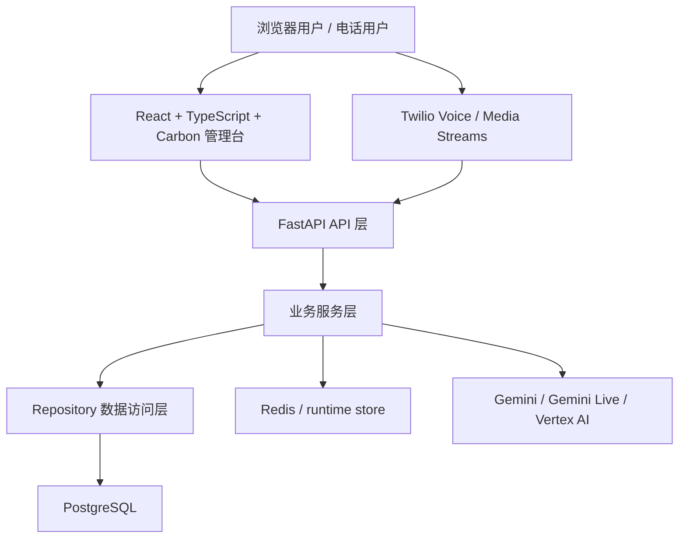
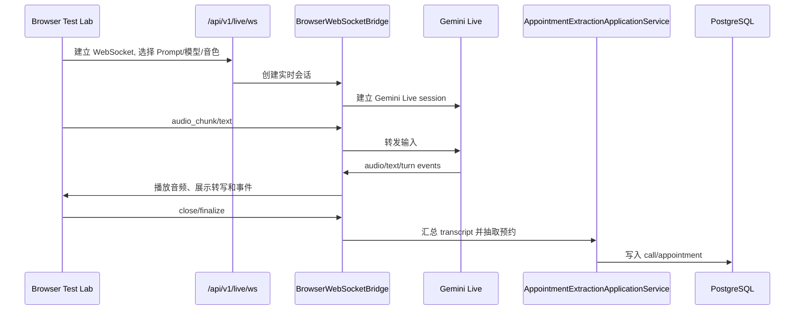
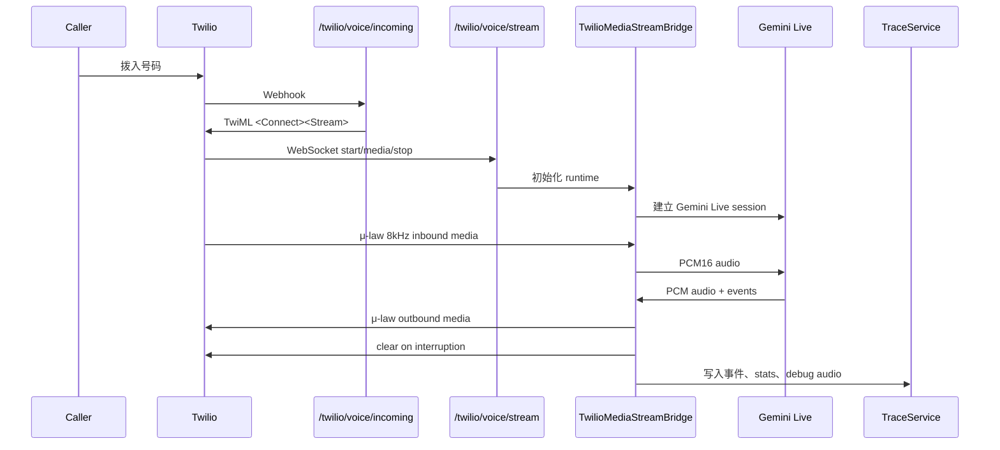
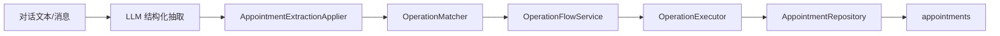

# 基本设计说明书

最后更新: 2026-05-25

## 1. 总体架构

系统采用前后端分离与后端分层架构。后端 API 层只处理协议、鉴权、请求/响应 schema 和 WebSocket 边界；业务编排进入 Service；持久化进入 Repository；外部 LLM/电话能力通过 adapter/service 封装。

## 2. 系统上下文

| 外部系统 | 交互方向 | 用途 |
| --- | --- | --- |
| Twilio Voice | Twilio -> Backend, Backend -> Twilio | PSTN/WebCall 电话接入、TwiML、Media Streams、状态回调 |
| Gemini Live | Backend <-> Google | 实时音频输入、语音回复、turn/activity 事件 |
| Gemini Generate | Backend -> Google | 文本对话、结构化抽取 |
| PostgreSQL | Backend <-> DB | 通话、预约、Prompt 持久化 |
| Redis | Backend <-> Redis | 缓存/共享 runtime store 预留 |
| Browser | Frontend <-> Backend | 管理台 REST、测试台 WebSocket、音频播放 |

## 2.1 语音主链路定位

当前产品主链路必须以 **自建 Twilio Media Streams + Gemini Live** 为准。原因是官方 Conversational Agents / CX Agent Studio 需要在 Google 平台维护流程、参数和 Agent，难以复用本系统的本地 `PromptTemplate` 动态切换、抽取 schema 和业务落库规则。

| 链路 | 定位 | 当前结论 |
| --- | --- | --- |
| 浏览器直连 Gemini Live | 模型能力和 Prompt 快速验证入口 | 已可用于证明 Gemini Live、Prompt 和浏览器音频路径基本可用 |
| Twilio 官方 Conversational Agents | 对照组/fallback | 可用于判断问题是否来自电话环境或上游能力，但不作为主产品路径 |
| Twilio Media Streams 自建桥接 | 电话座席主链路 | P0：必须优先修复第二轮后处理/turn state，并完成多轮稳定回归 |

## 3. 模块划分

### 3.1 后端模块

| 模块 | 主要路径 | 职责 |
| --- | --- | --- |
| API 路由 | `backend/app/api/v1/endpoints/` | REST/WebSocket 入口、请求参数解析、响应模型 |
| 核心配置 | `backend/app/core/` | Settings、数据库连接、日志、模型默认值 |
| Schema | `backend/app/schemas/` | Pydantic v2 DTO、统一响应模型 |
| Model | `backend/app/models/` | SQLAlchemy ORM |
| Repository | `backend/app/repositories/` | DB 查询、分页、CRUD |
| 通话服务 | `backend/app/services/call_service.py` | 通话记录与查询 |
| 预约服务 | `backend/app/services/appointments/` | 预约操作识别、匹配、执行、展示 |
| Prompt 服务 | `backend/app/services/prompt_service.py` | PromptTemplate 管理 |
| LLM 服务 | `backend/app/services/llm/` | LLM provider 抽象、Gemini 实现、工厂 |
| 实时语音 | `backend/app/services/live_gateway/` | 浏览器 WebSocket 到 Gemini Live 桥 |
| Twilio 服务 | `backend/app/services/twilio/` | 入站、Media Streams、转码、trace、诊断、官方链路 |
| 测试会话 | `backend/app/services/test_session_service.py` | 测试台会话生命周期与 finalize |

### 3.2 前端模块

| 模块 | 主要路径 | 职责 |
| --- | --- | --- |
| 页面 | `frontend/src/pages/` | Dashboard、Calls、Appointments、Prompts、Test、Settings |
| API Client | `frontend/src/api/` | REST/WebSocket 客户端、DTO 映射 |
| 原子化组件 | `frontend/src/components/` | atoms/molecules/organisms/templates |
| 测试台功能 | `frontend/src/features/test-lab/` | 文本和语音测试会话、Twilio trace monitor |
| Prompt 功能 | `frontend/src/features/prompts/` | Prompt 列表、编辑器、默认值 |
| Hooks | `frontend/src/hooks/` | 页面状态、实时连接、数据表状态 |
| i18n | `frontend/public/locales/` | zh-CN/en-US/ja-JP 文案 |

## 4. 关键业务流程

### 4.1 浏览器直连语音流程

### 4.2 Twilio Media Streams 电话流程

### 4.3 预约抽取与业务落库

核心原则：语音网关只提供 transcript 和上下文，预约创建/修改/取消的确定性规则由预约服务统一处理。

## 5. 数据设计概览

| 表 | 用途 | 关键字段 |
| --- | --- | --- |
| `calls` | 通话记录 | direction, counterpart, caller_name, status, transcript, summary, prompt_id, sip_call_id, extra_data |
| `appointments` | 预约记录 | call_id, caller_name, appointment, category, operation, is_handled, prompt_id, extracted_data |
| `prompt_templates` | Prompt 模板 | name, code, system_prompt, extraction_schema, llm_model, voice_id, twilio_inbound_numbers, is_active |

## 6. API 设计概览

基础前缀为 `/api/v1`。

| 分类 | 路由 | 用途 |
| --- | --- | --- |
| 健康检查 | `/health`, `/health/capabilities` | 服务状态和能力检查 |
| 仪表盘 | `/dashboard/stats` | 统计指标 |
| 通话 | `/calls` | 通话查询 |
| 预约 | `/appointments`, `/appointments/by-call/{call_id}`, `/appointments/{id}/handle` | 预约查询和处理 |
| Prompt | `/prompts`, `/prompts/{id}`, `/prompts/code/{code}` | Prompt CRUD |
| 文本对话 | `/chat`, `/chat/stream`, `/chat/extract`, `/chat/test/*` | 文本测试、SSE、抽取 |
| 浏览器语音 | `/live/session`, `/live/ws` | Gemini Live 浏览器直连 |
| Twilio | `/twilio/voice/*` | TwiML、Media Stream、状态、trace、token、诊断 |
| LLM | `/llm/models` | 可用模型/配置 |

## 7. 安全设计

- 非 local 环境必须配置 CORS origins，不允许 `*`。
- 管理类 API 通过 `APP_API_KEY` 启用 API Key 鉴权。
- Twilio webhook 通过 `TWILIO_VALIDATE_WEBHOOKS=true` 开启签名校验。
- Google 生产建议使用 Vertex AI + ADC/IAM，API Key 仅保留开发 fallback。
- `.env` 不提交；仅提交 `.env.example`。

## 8. 可观测性设计

- HTTP 请求中间件写入 `X-Request-ID`。
- 语音链路用 `call_sid`、`stream_sid`、`session_id` 关联事件。
- Twilio Media Streams 记录 trace、diagnostics、inbound debug wav。
- 排障顺序固定为：浏览器直连确认 Gemini/Prompt 能力 -> 官方 CX 作为电话环境对照 -> 自建 Media Streams trace/debug wav/audio lab 定位主链路问题。
