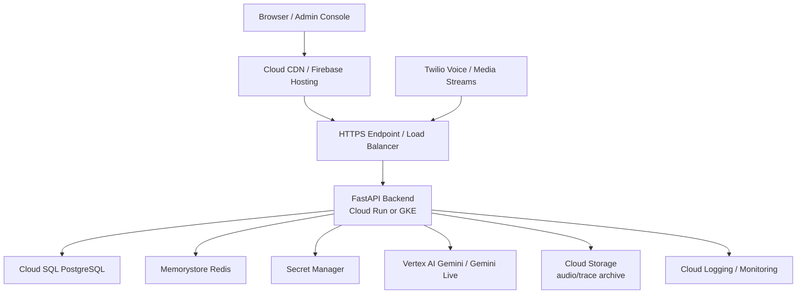

# 上云准备与后端风险交接说明书

最后更新: 2026-05-25

## 1. 文档目的

本文档用于把当前本地开发阶段的后端状态，转换成同事可以继续推进的上云准备任务。重点不是重复介绍功能，而是明确：

- 未来云上目标架构应该是什么。
- 当前后端距离云上生产还有哪些差距。
- 哪些问题是上云前必须解决的 P0。
- 哪些配置、密钥、账号和排障路径必须交接。
- 同事接手后如何验证每个风险已经关闭。

## 2. 当前结论

项目当前可以按 **本地开发 / 功能集成环境** 运行，但还不应直接按多实例生产系统上线。更关键的是，在自建 `Twilio Media Streams -> Gemini Live` 电话主链路稳定前，不应把主要精力转向上云生产化。

主要原因：

- 实时语音链路依赖 WebSocket 长连接和会话内状态，云上部署必须先明确 runtime state、负载均衡和超时策略。
- 浏览器直连 Gemini Live 已经能证明模型和 Prompt 能力，但不能证明 Twilio 电话主链路可交付。
- Twilio Media Streams 自建桥接已经具备框架能力，但第二轮后处理/turn state 仍未稳定，是当前最高优先级 P0。
- 官方 Conversational Agents/CX Agent Studio 需要在 Google 平台维护流程、参数和 Agent，无法替代本地 PromptTemplate 动态切换主路径，只能作为对照或 fallback。
- 管理 API 已有 API Key 保护基础，但还没有企业级 RBAC、SSO 和审计。
- Debug audio、trace、日志、密钥和环境变量目前更偏开发友好，需要按云上安全和合规要求治理。

## 2.1 上云准入前置条件

上云工作应以电话主链路稳定为准入条件。最低准入标准：

- 自建 Twilio Media Streams 链路真实电话连续 5-10 轮对话不挂死。
- 第二轮、第三轮用户发话后，Gemini Live 能继续产生 input transcript 和 response。
- 本地 `PromptTemplate` 可以在 Twilio 链路按号码、query 或默认模板动态切换。
- 不依赖 Google CA 平台手工维护业务流程即可完成 Prompt、模型、音色和抽取 schema 切换。
- 用户打断后 outbound queue 被 flush，Twilio 收到 `clear`，旧回复停止，后续回合继续。
- 通话结束后 transcript finalize，并进入预约抽取/落库。
- Trace 可以解释每一轮 inbound audio、Gemini event、outbound media、turn complete/interrupted。

## 3. 推荐云上目标架构

### 3.1 推荐选型

由于当前主 LLM/实时语音能力是 Gemini / Gemini Live，推荐优先采用 GCP 作为第一版云上目标环境。

| 层级 | 推荐服务 | 说明 |
| --- | --- | --- |
| 前端静态资源 | Cloud Storage + Cloud CDN 或 Firebase Hosting | 承载 Vite build 产物 |
| 后端 API/WebSocket | Cloud Run 或 GKE | Cloud Run 简化运维；GKE 适合更强网络和伸缩控制 |
| 数据库 | Cloud SQL for PostgreSQL | 替代本地 Docker PostgreSQL |
| Redis/runtime store | Memorystore for Redis | 支撑多实例共享状态和短期会话数据 |
| 密钥 | Secret Manager | 替代 `.env` 明文和本地密钥文件 |
| LLM | Vertex AI Gemini / Gemini Live | 使用 IAM/ADC，减少静态 API Key 风险 |
| 日志 | Cloud Logging | 采集 request_id、call_sid、session_id |
| 指标和告警 | Cloud Monitoring | WebSocket、Twilio、Gemini、DB、错误率指标 |
| 音频/录音归档 | Cloud Storage | 存储 debug wav 或正式录音，配置生命周期和访问控制 |
| 公网入口 | HTTPS Load Balancer / Cloud Run domain mapping | Twilio webhook 必须可公网 HTTPS 访问 |

### 3.2 高层架构图

### 3.3 Cloud Run 与 GKE 取舍

| 选项 | 优点 | 风险/注意点 | 建议 |
| --- | --- | --- | --- |
| Cloud Run | 部署简单、自动扩缩、运维成本低 | WebSocket 长连接、实例并发、请求超时和冷启动需要压测 | 第一版可选，但必须限制并发并压测 |
| GKE | 网络、伸缩、sidecar、连接治理能力强 | 运维复杂度高，需要 Kubernetes 经验 | 如果电话并发高或 WebSocket 行为不稳定，优先 GKE |
| 单 VM | 最接近本地，排障简单 | 可用性和伸缩差 | 只适合临时 PoC，不建议作为正式生产 |

## 4. 后端风险登记

### 4.1 P0：上云前必须关闭或明确规避

| 编号 | 风险/问题 | 当前表现 | 影响 | 建议处理 | 验收标准 |
| --- | --- | --- | --- | --- | --- |
| BR-P0-00 | Twilio + Gemini Live 自建 Media Streams 电话主链路未稳定 | 浏览器直连已通，但 Twilio 自建桥接第二轮后处理/turn state 仍有问题 | 核心电话座席不可交付，上云会放大排障成本 | 暂缓云上生产化，优先修复第二轮、多轮、turn boundary、outbound queue、interrupted/clear | 真实电话连续 5-10 轮稳定；第二轮后仍有 input transcript、model response、outbound media |
| BR-P0-01 | 官方 CA 无法作为主产品路径 | Google 平台内维护流程和参数，Prompt 切换无法复用本地 PromptTemplate | Prompt、抽取 schema、业务落库与本系统割裂 | 官方 CA 仅作为对照/fallback；主路径必须走自建 Media Streams | Twilio 主链路可按本地 PromptTemplate 动态切换，无需改 Google CA 流程 |
| BR-P0-02 | Twilio runtime store 默认 memory | 会话状态保存在进程内 | 多实例或多 worker 下 stream state 不共享，trace/clear/finalize 可能错位 | 主链路稳定后实现 Redis runtime store，或第一版明确单实例部署并关闭水平扩展 | 多实例压测下同一 call_sid/stream_sid 可正确读取状态 |
| BR-P0-03 | Twilio Media Streams 缺少生产压测证据 | 本地/手工测试为主 | 并发、弱网、长通话、多轮对话下稳定性未知 | 单通话多轮稳定后，再建立压测脚本、trace 指标和验收报告 | 给出并发数、平均延迟、断连率、turn 成功率 |
| BR-P0-04 | Barge-in 打断链路需要回归固化 | 有策略模块，但需端到端验证 | 用户打断时旧音频继续播放，造成双讲和体验失败 | 增加 mock Twilio/Gemini 的异步测试和真实电话 checklist | interrupted 后 queue flush、Twilio clear、旧回复停止、下一轮可继续 |
| BR-P0-05 | WebSocket 云上超时和负载均衡策略未定 | 本地 uvicorn 为主 | 长连接被代理或平台断开 | 明确 Cloud Run/GKE timeout、keepalive、并发、实例生命周期 | 30 分钟以上连接测试和断线恢复策略通过 |
| BR-P0-06 | Debug audio 本地落盘策略不适合生产 | debug wav 默认偏开发友好 | 隐私、存储膨胀、合规风险 | 生产关闭，或接 Cloud Storage + 生命周期 + 权限控制 | 生产环境无无限本地音频文件，访问可审计 |
| BR-P0-07 | Twilio webhook 云上验签需重新验证 | 生产需 `TWILIO_VALIDATE_WEBHOOKS=true` | 代理改写 URL/header 后签名可能失败或被绕过 | 在最终 HTTPS 域名下测试验签 | 错误签名被拒绝，正确 Twilio 请求通过 |
| BR-P0-08 | Secret 管理仍是本地 `.env` 思路 | `.env.example` 完整，但云上注入未设计 | 密钥泄露和环境漂移 | 接入 Secret Manager，定义密钥 owner 和轮换流程 | 云上无明文密钥文件，部署通过 Secret 注入 |
| BR-P0-09 | 数据库迁移发布流程未固化 | Alembic 可用，但发布顺序未文档化 | 上线时 schema 与代码不一致 | 制定 migrate -> deploy -> smoke test 流程 | 新环境可从空库执行 `alembic upgrade head` 成功 |

### 4.2 P1：上云后早期必须补强

| 编号 | 风险/问题 | 影响 | 建议处理 |
| --- | --- | --- | --- |
| BR-P1-01 | 管理 API 只有 API Key 基线 | 不满足企业用户、权限、审计要求 | 接入 IdP/SSO，增加 RBAC 和审计日志 |
| BR-P1-02 | 前端 API DTO 校验未完全统一 | 后端字段变化可能造成 UI 隐式错误 | 按 `FRONTEND_API_CONTRACT.md` 补齐 Zod mapper |
| BR-P1-03 | Prompt 版本治理不足 | 生产 Prompt 改动难回滚 | 增加复制、版本、发布、回滚、默认模板审计 |
| BR-P1-04 | Trace 与业务记录联动不足 | 通话问题定位链路长 | 通话详情页增加 trace 跳转和诊断摘要 |
| BR-P1-05 | 监控告警未闭环 | 故障依赖人工发现 | 建立错误率、断线率、LLM 失败率、预约抽取失败率告警 |
| BR-P1-06 | 多供应商抽象未完全产品化 | provider 切换成本不明 | 定义 provider contract、兼容测试和降级策略 |

## 5. 环境变量交接矩阵

不要在文档中交接真实密钥。应交接变量名、用途、申请渠道、云上存放位置和 owner。

| 变量 | 本地是否必填 | 云上是否必填 | 建议存放 | 说明 |
| --- | --- | --- | --- | --- |
| `ENVIRONMENT` | 是 | 是 | 环境配置 | local/staging/production |
| `CORS_ORIGINS` | 是 | 是 | 环境配置 | 云上必须是明确域名，不允许 `*` |
| `APP_API_KEY` | 可选 | 是 | Secret Manager | 管理 API 基线保护 |
| `DATABASE_URL` | 是 | 是 | Secret Manager | 本地指向 Docker，云上指向 Cloud SQL |
| `REDIS_URL` | 建议 | 是 | Secret Manager | 云上 runtime store/缓存 |
| `GOOGLE_API_KEY` | 开发可用 | 不推荐 | Secret Manager | 本地 fallback；生产优先 Vertex AI ADC |
| `GOOGLE_GENAI_USE_VERTEXAI` | 可选 | 推荐 true | 环境配置 | 云上建议使用 Vertex AI |
| `GOOGLE_CLOUD_PROJECT` | Vertex 时必填 | 是 | 环境配置 | GCP project id |
| `GOOGLE_CLOUD_LOCATION` | Vertex 时必填 | 是 | 环境配置 | 默认 global |
| `GOOGLE_APPLICATION_CREDENTIALS` | 本地可选 | 不建议文件路径 | Workload Identity/ADC | 云上优先使用服务账号绑定 |
| `DEFAULT_LLM_MODEL` | 是 | 是 | 环境配置 | 文本生成默认模型 |
| `DEFAULT_LIVE_MODEL` | 是 | 是 | 环境配置 | Gemini Live 默认模型 |
| `TWILIO_ACCOUNT_SID` | Twilio 时必填 | Twilio 时必填 | Secret Manager | Twilio 账号 |
| `TWILIO_AUTH_TOKEN` | Twilio 时必填 | Twilio 时必填 | Secret Manager | webhook 验签和 Twilio API |
| `TWILIO_API_KEY_SID` | WebCall 时必填 | WebCall 时必填 | Secret Manager | Voice SDK token |
| `TWILIO_API_KEY_SECRET` | WebCall 时必填 | WebCall 时必填 | Secret Manager | Voice SDK token |
| `TWILIO_TWIML_APP_SID` | WebCall 时必填 | WebCall 时必填 | Secret Manager | TwiML App |
| `TWILIO_PHONE_NUMBER` | Twilio 时必填 | Twilio 时必填 | 环境配置/Secret | 业务入口号码 |
| `TWILIO_VALIDATE_WEBHOOKS` | 建议 true | 必须 true | 环境配置 | 生产必须开启 |
| `TWILIO_RUNTIME_STORE_BACKEND` | memory 可用 | 建议 redis | 环境配置 | 多实例必须使用共享后端 |
| `TWILIO_MEDIA_STREAM_DEBUG_INBOUND_WAV_ENABLED` | 可 true | 建议 false | 环境配置 | 生产谨慎启用 |

## 6. 上云前交接材料清单

### 6.1 必交材料

- 云上目标架构图和服务选型说明。
- staging/production 环境变量矩阵。
- Secret Manager 密钥清单、owner、申请渠道和轮换周期。
- Twilio 控制台配置截图或文字说明：号码、Voice URL、Status Callback、TwiML App。
- Google Cloud 项目、服务账号、IAM 角色、Vertex AI 启用状态。
- Cloud SQL 数据库、用户、网络连接方式、备份策略。
- Redis/Memorystore 连接方式和容量预估。
- Alembic 迁移步骤和回滚策略。
- WebSocket timeout、实例并发、最小实例数、最大实例数配置。
- 生产日志字段规范：request_id、call_sid、stream_sid、session_id、prompt_code。

### 6.2 不应直接交接的内容

- 明文 `.env`。
- Twilio Auth Token 明文。
- Google API Key 明文。
- 服务账号 JSON key 明文。
- 数据库密码明文。
- 含真实用户语音或个人信息的 debug wav。

这些内容应通过 Secret Manager、密码管理器或公司内部权限系统授权。

## 7. 后端排障路径

### 7.1 API 不通

检查顺序：

1. `/api/v1/health` 是否返回成功。
2. 后端日志是否有 request_id。
3. CORS origins 是否包含前端域名。
4. 非 local 环境是否缺少 `APP_API_KEY` 或请求头。
5. 反向代理是否转发正确 path 和 header。

### 7.2 数据库连接失败

检查顺序：

1. `DATABASE_URL` 是否使用正确 driver。
2. Cloud SQL 网络连接、授权网络或 connector 是否正确。
3. Alembic 当前版本：`alembic current`。
4. 连接池数量是否超过 Cloud SQL 限制。
5. 日志中是否有认证失败、DNS 失败或 timeout。

### 7.3 Gemini 鉴权或模型失败

检查顺序：

1. `GOOGLE_GENAI_USE_VERTEXAI` 是否符合当前环境。
2. Vertex AI API 是否启用。
3. 服务账号是否有调用 Vertex AI/Gemini 权限。
4. `DEFAULT_LLM_MODEL` 和 `DEFAULT_LIVE_MODEL` 是否可用。
5. 是否触发配额限制。

### 7.4 Twilio webhook 没进来

检查顺序：

1. Twilio Voice URL 是否是公网 HTTPS。
2. 路径是否为 `/api/v1/twilio/voice/incoming` 或预期入口。
3. 云端 ingress/load balancer 是否允许 Twilio 请求。
4. 后端日志是否出现 Twilio 请求。
5. Twilio 控制台 debugger 是否有 4xx/5xx。

### 7.5 Media Stream 建立但没有识别

检查顺序：

1. trace 是否有 `start` 和持续 `media`。
2. inbound chunk 计数是否增加。
3. debug wav 是否能听清用户声音。
4. μ-law 8kHz -> PCM16 转码是否正常。
5. Gemini Live 是否收到 audio chunk。
6. activity detection 是否被错误切到 manual/auto 混用。

### 7.5.1 第一轮正常、第二轮后卡死

这是当前最高优先级排障路径。

检查顺序：

1. 第二轮 Twilio inbound `media` 是否仍持续进入 WebSocket。
2. 第二轮 inbound chunk 计数是否增加，debug wav 是否包含第二轮用户声音。
3. Gemini Live session 是否仍 open，是否被第一轮结束逻辑关闭。
4. 第一轮后是否误发 `audio_end`，导致后续音频不再被作为同一会话输入。
5. 自动 activity detection 是否与手动 `activity_start` / `activity_end` 混用。
6. outbound 播放队列是否阻塞 inbound receive loop。
7. interrupted/clear 是否误触发，导致第二轮音频或回复被丢弃。
8. trace 中是否有第二轮 input transcript；如果没有，优先查音频/turn boundary；如果有 transcript 但没回复，优先查 Gemini receive loop 和 response state。

### 7.6 Gemini 有回复但 Twilio 没播放

检查顺序：

1. Gemini response audio 是否进入 outbound queue。
2. PCM -> μ-law 编码是否成功。
3. Twilio WebSocket 是否仍然 open。
4. 是否误触发 clear 或 interrupted。
5. Twilio 侧是否收到 outbound media。

### 7.7 通话结束后没有预约记录

检查顺序：

1. call/session 是否 finalize。
2. transcript 是否为空。
3. Prompt 是否有 extraction schema。
4. LLM 抽取是否报错或返回无效 JSON。
5. `AppointmentExtractionApplicationService` 是否执行。
6. appointments 表是否写入失败。

## 8. 上云实施顺序建议

### 阶段 0：Twilio 主链路稳定化

1. 用真实 Twilio 电话稳定复现第二轮问题。
2. 固化 trace 字段，覆盖 inbound audio、Gemini input transcript、model response、outbound media、turn complete/interrupted。
3. 修复第二轮后处理/turn state。
4. 验证本地 PromptTemplate 动态切换。
5. 完成 5-10 轮真实电话验收。
6. 完成 barge-in 基础回归。

阶段 0 未通过前，不建议进入云上生产化。

### 阶段 1：Staging 基础设施

1. 创建 GCP project / staging 环境。
2. 创建 Cloud SQL PostgreSQL。
3. 创建 Memorystore Redis。
4. 创建 Secret Manager 密钥。
5. 部署后端单实例 Cloud Run 或 GKE staging。
6. 部署前端 staging。
7. 跑通 `/health`、Alembic、Prompt CRUD。

### 阶段 2：Gemini 与浏览器语音

1. 切换 Vertex AI/ADC。
2. 验证文本聊天。
3. 验证浏览器直连 Gemini Live。
4. 验证测试会话 finalize 和预约落库。

### 阶段 3：Twilio 电话链路

1. 配置 staging HTTPS Voice URL。
2. 开启 Twilio webhook 签名校验。
3. 跑通入站电话。
4. 验证 Media Streams trace。
5. 验证 barge-in。
6. 验证通话结束 finalize。

### 阶段 4：生产化加固

1. Redis runtime store。
2. WebSocket 长连接和并发压测。
3. 日志指标告警。
4. Debug audio 生产治理。
5. CI/CD 和发布审批。
6. 生产 cutover checklist。

## 9. 同事接手后的第一批任务

建议分配给后端/云工程同事的第一批任务：

| 顺序 | 任务 | 产出 |
| --- | --- | --- |
| 1 | 跑通本地后端、前端、数据库 | 本地启动记录和问题修正文档 |
| 2 | 整理 Settings 与 `.env.example` 差异 | 完整配置说明 PR |
| 3 | 复现并定位 Twilio 第二轮卡死问题 | trace、debug wav、初步根因说明 |
| 4 | 修复自建 Media Streams 多轮主链路 | 真实电话 5-10 轮验收记录 |
| 5 | 验证本地 PromptTemplate 动态切换 | query/号码/default 三种路径的验证记录 |
| 6 | 设计 Redis runtime store | 技术方案和接口边界 |
| 7 | 搭建 staging Cloud SQL/Redis/Secrets | 基础设施记录 |
| 8 | 部署后端 staging | 可访问的 `/health` 和 Swagger |
| 9 | 建立 Twilio staging webhook | 一次成功电话 trace |
| 10 | 补 barge-in 自动化/半自动化回归 | 测试用例和报告 |
| 11 | 建立最小 CI | pytest、frontend build、i18n check |

## 10. 上云验收清单

- [ ] 后端 staging 通过 `/api/v1/health`。
- [ ] Alembic 可从空库升级到 head。
- [ ] 前端 staging 可访问并调用后端。
- [ ] 管理 API 在无 API Key 时被拒绝。
- [ ] Twilio webhook 签名校验通过真实请求，拒绝伪造请求。
- [ ] 浏览器直连 Gemini Live 可多轮对话。
- [ ] 自建 Twilio Media Streams 入站电话可连续 5-10 轮对话。
- [ ] 第二轮、第三轮用户发话后仍能产生 input transcript、model response 和 outbound media。
- [ ] Twilio 主链路可使用本地 PromptTemplate 动态切换，不依赖 Google CA 平台流程修改。
- [ ] 用户打断后 Twilio clear 生效。
- [ ] 通话结束后 call/appointment 可落库。
- [ ] WebSocket 长连接压测达到目标时长和并发。
- [ ] 日志可按 request_id/call_sid/session_id 检索。
- [ ] debug audio 不在生产无限本地落盘。
- [ ] Secret 不以明文文件形式存在运行环境。
